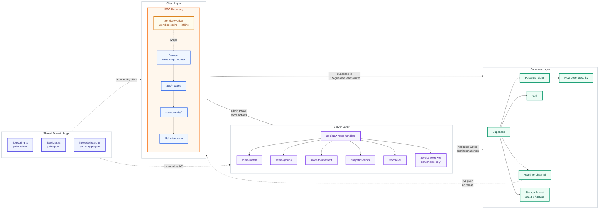
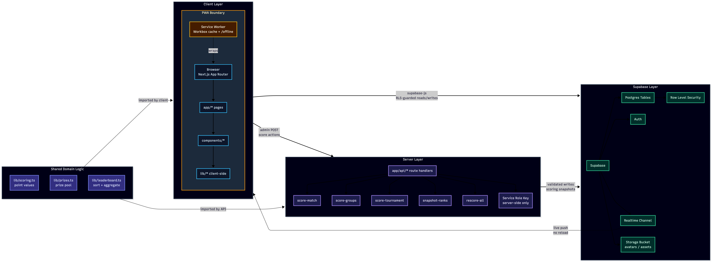

<p align="center">
  
</p>

<h1 align="center">MatchDay</h1>

<p align="center">
  <strong>Private World Cup 2026 prediction league</strong><br/>
  Predict every scoreline · Compete on a live leaderboard · Settle the prize pool
</p>

<p align="center">
  
  
  
  
  
  
</p>

---

## Table of contents

- [What is MatchDay?](#what-is-matchday)
- [How it works](#how-it-works)
- [Scoring](#scoring)
- [Prize pool](#prize-pool)
- [Features](#features)
- [Pages & routes](#pages--routes)
- [Install as an app (PWA)](#install-as-an-app-pwa)
- [Admin workflow](#admin-workflow)
- [Tech stack](#tech-stack)
- [Architecture](#architecture)
- [Project structure](#project-structure)
- [Local development](#local-development)
- [Deployment](#deployment)

---

## What is MatchDay?

MatchDay is a private, invite-only prediction league for FIFA World Cup 2026. Before every match kicks off, each player submits their predicted scoreline — and optional bonus picks like first scorer and goal difference. An admin enters the real result, points settle instantly, and the leaderboard and zero-sum prize pool update in real time.

It covers the full tournament — 104 matches across group stage and all knockout rounds, group finishing orders, and a complete bracket prediction — spread across 8 scored gameweeks. Leagues are private and admin-created: each group of friends gets its own isolated standings and prize pool.

---

## How it works

**1. Join your league**
Sign up with your email, enter your invite code, and you're in. Leagues are private — only people with the code can join. Multiple leagues are supported; you can be in more than one.

**2. Submit predictions before kickoff**
Head to **Fixtures** and submit your scoreline for each match. On top of the score you can predict:
- **First-goal team** — which side opens the scoring
- **First scorer** — the specific player (highest reward)
- **Total goals** — independent hedge that earns points even when the exact score is wrong
- **Goal difference** — a second hedge, settable per-league by the admin

Predictions lock at kickoff. The admin enters the result and every prediction is scored automatically across all per-category columns.

**3. Compete across 8 gameweeks**
Points accumulate across the group stage and all knockout rounds. The leaderboard is live — Supabase Realtime pushes updates the moment results are scored, no refresh needed.

**4. Predict the structure**
Beyond individual matches you can predict group finishing orders (+2 per correct placement) and pick the full knockout bracket — champion, runner-up, semi-finalists, and quarter-finalists (up to +47 pts).

**5. The prize pool settles itself**
Every gameweek and the overall standings pay out (and claw back) based on finishing position. The dashboard shows your current rank, settled net, projected total, and best/worst prize outcome at all times.

---

## Scoring

### Match predictions — max 14 pts

| Category | Points | Notes |
|---|---|---|
| Correct outcome (win / draw / loss) | **+3** | Always available |
| Exact scoreline | **+3** | Stacks with outcome |
| Correct goal difference | **+2** | Set independently of the scoreline |
| Correct total goals | **+1** | Set independently of the scoreline |
| Both teams to score — correct call | **+1** | Derived from your score pred |
| Correct first-goal team | **+2** | Optional pick |
| Correct first scorer | **+4** | Optional pick, highest single reward |

Total goals and goal difference are entered **separately** from the scoreline, so a smart hedge can bank points even when the exact score is wrong. Goal difference scoring can be toggled on or off per league by the admin.

Own goals are handled separately — a player who scores an own goal does not count as the "first scorer" for the opposing team's purposes.

### Group predictions

**+2** for each team placed in the correct group finishing position — max 8 pts per group, across 12 groups.

### Tournament bracket — max 47 pts

| Pick | Points |
|---|---|
| Champion | **+15** |
| Runner-up | **+8** |
| Each correct semi-finalist (×2) | **+4** |
| Each correct quarter-finalist (×4) | **+2** |

---

## Prize pool

Zero-sum pool settled per gameweek (GW1–GW8) and overall at the end of the tournament.

| Position | Per gameweek | Overall |
|---|---|---|
| 1st | +$15 | +$40 |
| 2nd | +$10 | +$20 |
| 3rd | +$5 | +$10 |
| 4th | $0 | $0 |
| 5th | -$5 | -$10 |
| 6th | -$10 | -$20 |
| 7th | -$15 | -$40 |

**Tiebreakers:** most points → most correct outcomes → alphabetical.

**Gameweek mapping:**

| Gameweek | Stage |
|---|---|
| GW1 / GW2 / GW3 | Group Stage (Days 1–3) |
| GW4 | Round of 32 |
| GW5 | Round of 16 |
| GW6 | Quarter-finals |
| GW7 | Semi-finals |
| GW8 | Final + 3rd place play-off |

---

## Features

### Predictions & gameplay

| Feature | Detail |
|---|---|
| Scoreline prediction | Home/away goals with stepper controls, locks at kickoff |
| First scorer pick | Choose from full 26-man squad roster |
| Goal diff & total goals | Independent hedges set separately from the scoreline |
| Own goal toggle | Admin can mark a goal as own goal; excludes it from first-scorer scoring |
| Group order predictor | Drag-and-drop (or tap) group finishing predictions for all 12 groups |
| Knockout bracket | Pick champion, runner-up, semi-finalists, quarter-finalists |
| Per-league goal diff | Admin can enable/disable goal difference scoring per league |

### Fixtures & results

| Feature | Detail |
|---|---|
| Filter tabs | Open · Today · Missing · Closed · Full — always know where to act |
| Points colour coding | `+N pts` pill turns green / amber / red based on % of max possible points |
| Stage filter | All stages · Group Stage · Knockout — second filter row |
| Consensus reveal | After kickoff, every member's full prediction for that match is revealed |
| Prediction wall | See the whole league's pick distribution per match |

### Leaderboard & social

| Feature | Detail |
|---|---|
| Live leaderboard | Supabase Realtime; rank arrows ▲▼, point totals, prize column |
| Per-GW leaderboard | Switch between overall standings and any individual gameweek |
| H2H compare | Head-to-head stats, win/draw/loss record, and side-by-side points race chart |
| Points race chart | Season cumulative · By GW bar · Specific GW match breakdown — three tabs |
| Activity feed | Live league event feed on the dashboard |
| CSV export | Download full leaderboard as a spreadsheet |

### Profile & personalisation

| Feature | Detail |
|---|---|
| Profile page | Stats, accuracy by category, rank movement, GW breakdown, bracket picks |
| Rank movement chart | Season (date-labelled snapshots) · By GW · Specific GW — three tabs |
| Badge system | 6 auto-calculated achievement badges (Scoreline Sniper, Golden Boot Guru, …) |
| Avatar upload | Circular crop tool on upload — drag to reposition, slider to zoom |
| Light / dark mode | Follows system preference; toggle in header |

### Admin

| Feature | Detail |
|---|---|
| Result entry | Score/first scorer per match; locks prediction input for all players |
| Scoring audit log | Every action recorded in `scoring_events` |
| Snapshot leaderboard | Captures rank state for movement arrows |
| Score groups | Run after group stage is complete |
| Score tournament | Run after each knockout round |
| Rescore all | Full recompute; use after any rule or data correction |
| Rate limiting | Token-bucket rate limit (10 req/min) on all scoring API routes |

### Platform

| Feature | Detail |
|---|---|
| PWA | Installable on iOS, Android, and desktop; offline shell; OS shortcuts |
| 48-team squads | Full 26-man rosters for all WC2026 nations, searchable by team |
| Multi-league | Admin-created leagues with unique join codes; independent standings |
| Invite links | Shareable `?code=` links that pre-fill the join form |
| Mobile-first | Fully responsive; all pages optimised for PWA/phone use |

---

## Pages & routes

| Route | Description |
|---|---|
| `/` | Landing page |
| `/login` | Email/password auth |
| `/dashboard` | Rank, stats, hero match, form strip, mini-leaderboard, prize outlook, activity feed |
| `/predictions` | All fixtures with filters; quick-predict bottom sheet |
| `/match/[id]` | Full prediction form, consensus reveal, prediction wall |
| `/groups` | Group finishing order predictor (all 12 groups) |
| `/bracket` | Full knockout bracket + tournament picks |
| `/leaderboard` | Live standings, per-GW view, rank movement, CSV export |
| `/h2h` | Head-to-head compare — pick any two members, see full breakdown |
| `/squads` | 48-nation squad browser with position grouping and jersey numbers |
| `/profile` | Your stats, accuracy, rank chart, badges, bracket picks, group picks |
| `/rules` | Scoring rules reference |
| `/install` | PWA install guide with platform detection |
| `/offline` | Offline fallback page (served by service worker) |
| `/admin` | Result entry + all scoring & admin actions |
| `/api/score-match` | Server route — score one match (admin only) |
| `/api/score-groups` | Server route — score group predictions (admin only) |
| `/api/score-tournament` | Server route — score bracket predictions (admin only) |
| `/api/snapshot-ranks` | Server route — capture rank snapshot (admin only) |
| `/api/rescore-all` | Server route — full recompute (admin only) |

---

## Install as an app (PWA)

MatchDay is a Progressive Web App — install it directly from your browser, no App Store needed.

| Platform | Steps |
|---|---|
| **iPhone / iPad** | Safari → Share icon → **Add to Home Screen** |
| **Android** | Chrome → ⋮ menu → **Add to Home screen** (or tap the install banner) |
| **Desktop** | Click the **Install** icon in the Chrome / Edge address bar |

Once installed it opens full-screen with no browser chrome, loads instantly from cache, and shows a graceful offline page if you lose connectivity.

---

## Admin workflow

1. **Enter a result** — on `/admin` expand a match, enter the real score, first-goal team, first scorer, and own goal flag → **Save & score**. Locks the match and calculates every player's points across all per-category columns.
2. **Snapshot leaderboard** — captures current ranks so movement arrows (▲▼) are accurate on the next session.
3. **Score group predictions** — run after each group is fully played; only fully-resulted groups are scored.
4. **Score tournament picks** — run after each knockout round to award bracket points.
5. **Rescore all** — recomputes every prediction from scratch; use after any rule or data correction.

---

## Tech stack

<p>
  
  
  
  
</p>
<p>
  
  
  
  
</p>

| Layer | Technology |
|---|---|
| Framework | Next.js 14 — App Router, server + client components, API route handlers |
| Language | TypeScript (strict mode throughout) |
| UI | React 18, Tailwind CSS with CSS-variable design tokens (light/dark via `.dark` on `<html>`) |
| Database | Supabase Postgres with Row Level Security — users read everything, write only their own rows |
| Auth | Supabase Auth — email/password; `middleware.ts` guards every route except `/login` |
| Realtime | Supabase Realtime — leaderboard updates push to all clients on result entry |
| Storage | Supabase Storage — `avatars` bucket (public-read) for profile photos |
| PWA | `@ducanh2912/next-pwa` (Workbox service worker, offline shell, app badge) |
| Hosting | Vercel — auto-deploys on push to `main` |
| Design | Schibsted Grotesk typeface, token-driven colour scheme, custom SVG charts |

---

## Architecture



<details>
<summary>Static diagram — light mode</summary>


</details>

<details>
<summary>Static diagram — dark mode</summary>



</details>

**Data flow:**

1. User submits a prediction → client writes to `predictions` table via supabase-js (RLS enforces own-row-only writes).
2. Admin enters a result on `/admin` → POST to `app/api/score-match` → handler reads `lib/scoring.ts` constants, computes per-category points, writes breakdown back to each `predictions` row.
3. `lib/leaderboard.ts` aggregates scored predictions client-side (shared between dashboard mini-table and `/leaderboard`).
4. `lib/prizes.ts` derives prize snapshot from aggregated standings.
5. Supabase Realtime pushes `predictions` UPDATE events to all connected clients — standings update instantly with no page reload.

**Auth:** `middleware.ts` intercepts every request and redirects unauthenticated users to `/login`. All point values are defined once in `lib/scoring.ts` and `lib/prizes.ts` — the UI imports constants and never hardcodes them.

---

## Project structure

```
app/
  page.tsx                  Landing page
  login/                    Email/password auth
  dashboard/                Rank, stats, hero match, form strip, prize, activity feed
  predictions/              Fixtures list — filters, quick-predict popover, pts colour coding
  match/[id]/               Full prediction form, consensus reveal, prediction wall
  groups/                   Group order predictor (all 12 groups)
  bracket/                  Knockout bracket + tournament picks
  leaderboard/              Live standings, per-GW view, rank arrows, CSV export
  h2h/                      Head-to-head compare — stats + points race chart (Season/By GW/Specific GW)
  squads/                   48-nation squad browser with position grouping
  profile/                  Stats, accuracy by category, rank chart tabs, badges, avatar crop
  install/                  PWA install guide with platform detection
  offline/                  Offline fallback (rendered by service worker)
  rules/                    Scoring rules reference
  admin/                    Result entry + scoring actions (is_admin guard)
  api/
    score-match/            Score one match + notify Realtime
    score-groups/           Score group finishing predictions
    score-tournament/       Score bracket predictions
    snapshot-ranks/         Capture rank snapshot
    rescore-all/            Full recompute of all scored predictions

components/
  AppShell.tsx              Desktop sidebar + mobile bottom nav + theme toggle
  ui.tsx                    Design system — Button, Card, StatCard, Pill, Avatar,
                            ScoreStepper, Countdown, Modal, CountUp, icons, Logo
  football.tsx              MatchCard, NextPredictCard, LeaderboardTable
  FlagChip.tsx              Flag images for all 48 nations (flag-icons, FIFA→ISO2 map)
  charts.tsx                BarChart, AreaChart, RankLine (SVG, no external dependency)
  RulesContent.tsx          Shared rules copy — used by RulesModal + /rules page
  RulesButton.tsx           Client island — shows rules modal from the login page

lib/
  scoring.ts                Single source of truth for all point values (POINTS, SCORING_RULES,
                            scorePrediction, ScoringWeights, DEFAULT_WEIGHTS)
  prizes.ts                 Prize pool constants (GW_PRIZES, OVERALL_PRIZES) + computePrizeSnapshot
  leaderboard.ts            aggregateLeaderboard() — shared aggregation + canonical sort
  league.ts                 getActiveLeague(), isMoneyLeague(), multi-league helpers
  match-ui.ts               DBMatch / MyPred types + toUIMatch helper
  teams.ts                  48 WC2026 teams (code, name, fullName, flag, playerKey)
                            + normalisePosition, POSITION_ORDER, POSITION_ABBR, FLAG_GRADIENTS
  pwa.ts                    useInstallPrompt(), useAppBadge() hooks
  hooks.ts                  useMyLeagues(), useActiveLeague() with 30s TTL cache
  rate-limit.ts             In-memory token bucket (10 req/min per key)
  supabase-browser.ts       Browser Supabase client (anon key)
  supabase-server.ts        Server Supabase client (service role, RSC)
  supabase-middleware.ts    Middleware Supabase client (session refresh)

supabase/migrations/        SQL migrations — applied in filename order via supabase db push
scripts/
  fetch-players.ts          Pull WC2026 squads from football-data.org → players table
middleware.ts               Unauthenticated → /login for all routes
```

---

## Local development

### 1. Clone and install

```bash
git clone <your-repo-url>
cd wc26-predictor
npm install
```

### 2. Environment variables

Create `.env.local` in the project root:

```env
NEXT_PUBLIC_SUPABASE_URL=https://<your-project-ref>.supabase.co
NEXT_PUBLIC_SUPABASE_ANON_KEY=<your-anon-key>
```

Find these in Supabase → **Project Settings → API**.

### 3. Apply database migrations

```bash
brew install supabase/tap/supabase   # macOS; see supabase.com/docs for other platforms
supabase login --token <your-access-token>
supabase link --project-ref <your-project-ref>
supabase db push
```

| Migration | Contents |
|---|---|
| `000000_initial_schema` | Core tables (rounds, matches, profiles, predictions), RLS policies, `is_admin()` function |
| `000001_seed_matches` | All 104 WC2026 matches across 12 groups + knockout rounds |
| `000002_add_group_gameweek` | `group_name`, `gameweek` columns on matches |
| `000003_players` | Players table (name, position, jersey number, nationality) |
| `000000_design_upgrade` | Per-category scoring columns on predictions, `group_predictions` table |
| `000001_avatar_storage` | `avatars` storage bucket + public-read policies |
| `000002_lineups` | `lineups` table |
| `000000_bracket_and_rank` | `tournament_predictions`, `rank_snapshots` tables |
| `000001_gameweek_number` | `matches.gw_number`, player jersey + photo fields |
| `000002_match_winner` | `matches.match_winner` for knockout shootout results |
| `000003_pred_goal_fields` | `predictions.pred_total_goals`, `pred_goal_diff` (independent hedges) |
| `000005_cleanup_indexes` | Performance indexes + admin-only rank_snapshots RLS policy |
| `000006_events` | `scoring_events` audit log + `league_events` activity feed |

### 4. Run

```bash
npm run dev     # Development server — http://localhost:3000
npm run build   # Production build (generates service worker)
npm run lint    # ESLint (next lint)
npx tsc --noEmit  # TypeScript check
```

> **PWA note:** the service worker is disabled in development to avoid stale-cache issues. To test offline behaviour: `npm run build && npm start`, then open Chrome DevTools → Application → Service Workers → tick **Offline**.

### 5. Grant admin access

In Supabase → **Table Editor → `profiles`**, set `is_admin = true` for your account. The **Admin** nav link appears on next page load.

### 6. Populate player data (optional)

```bash
FOOTBALL_API_TOKEN=<token> \
SUPABASE_URL=https://<ref>.supabase.co \
SUPABASE_SERVICE_KEY=<service-role-key> \
npx tsx scripts/fetch-players.ts
```

Get a free token at [football-data.org](https://www.football-data.org/client/register). The free tier allows 10 req/min and does not include player photos. The script fetches all 48 WC2026 squads (~1,250 players total) with a 7-second delay between teams to stay within rate limits.

---

## Deployment

1. Push the repository to GitHub.
2. On [vercel.com](https://vercel.com) → **Add New Project** → import the repo. Next.js is auto-detected.
3. Add environment variables under **Settings → Environment Variables** for Production, Preview, and Development:
   - `NEXT_PUBLIC_SUPABASE_URL`
   - `NEXT_PUBLIC_SUPABASE_ANON_KEY`
4. In Supabase → **Authentication → URL Configuration → Redirect URLs**, add `https://<your-vercel-domain>/auth/callback`.
5. Vercel deploys automatically on every push to `main`.

---

<p align="center">
  Built for WC2026 · Private league · Not affiliated with FIFA
</p>
