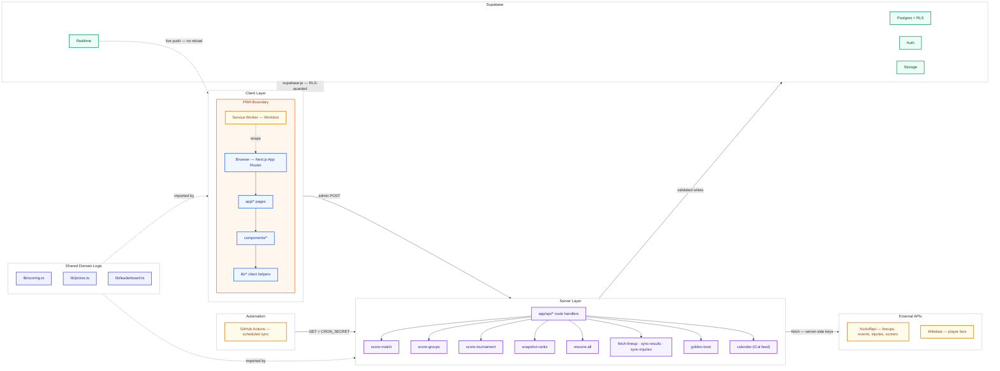

<p align="center">
  
</p>

<h1 align="center">MatchDay</h1>

<p align="center">
  <strong>Private World Cup 2026 prediction league</strong><br/>
  Predict every scoreline &nbsp;·&nbsp; Compete on a live leaderboard &nbsp;·&nbsp; Settle the prize pool
</p>

<p align="center">
  
  
  
  
  
  
</p>

<br/>

MatchDay is a private, invite-only prediction league for FIFA World Cup 2026. Players predict scorelines, group finishing orders, and the full knockout bracket across 104 matches. An admin enters real results, points settle instantly via server-side scoring, and a zero-sum prize pool updates live — no page refresh needed.

<br/>

---

## Contents

- [How it works](#how-it-works)
- [Scoring](#scoring)
- [Prize pool](#prize-pool)
- [Features](#features)
- [Tech stack](#tech-stack)
- [Architecture](#architecture)
- [Local development](#local-development)
- [Deployment](#deployment)

---

## How it works

**1. Join your league** &nbsp;—&nbsp; Sign up with email, enter your invite code, and you're in. Leagues are private and admin-created; each group of friends gets its own isolated standings and prize pool. Multiple leagues are supported.

**2. Submit predictions before kickoff** &nbsp;—&nbsp; Head to **Fixtures** and enter your scoreline for each match. On top of the score, you can predict:

- **First-goal team** — which side opens the scoring
- **First scorer** — the specific player (highest reward, +4 pts)
- **Total goals** — an independent hedge that earns points even if the exact score is wrong
- **Goal difference** — a second hedge, togglable per league by the admin

Predictions lock at kickoff. The admin enters the result and every prediction is scored automatically across all per-category columns.

**3. Compete across 8 gameweeks** &nbsp;—&nbsp; Points accumulate through the group stage and all knockout rounds. Supabase Realtime pushes leaderboard updates the moment results land — no refresh needed.

**4. Predict the structure** &nbsp;—&nbsp; Beyond individual matches, predict group finishing orders (+2 per correct placement) and the full knockout bracket — champion, runner-up, semi-finalists, and quarter-finalists (up to +47 pts total).

**5. The prize pool settles itself** &nbsp;—&nbsp; Each gameweek and the overall standings pay out and claw back based on finishing position. The dashboard shows your current rank, settled net, projected total, and best/worst prize range at all times.

---

## Scoring

### Match predictions &nbsp;—&nbsp; max 14 pts

| Category | Pts | Notes |
| :--- | :---: | :--- |
| Correct outcome (W / D / L) | **+3** | Always available |
| Exact scoreline | **+3** | Stacks with outcome |
| Correct goal difference | **+2** | Set independently of the scoreline |
| Correct total goals | **+1** | Set independently of the scoreline |
| Both teams to score — correct call | **+1** | Derived from your score prediction |
| Correct first-goal team | **+2** | Optional pick |
| Correct first scorer | **+4** | Optional pick — highest single reward |

> Total goals and goal difference are entered **separately** from the scoreline, so a well-placed hedge can bank points even when the exact score is wrong.

### Group predictions

**+2** for each team placed in the correct group finishing position — max 8 pts per group across 12 groups.

### Tournament bracket &nbsp;—&nbsp; max 47 pts

| Pick | Pts |
| :--- | :---: |
| Champion | **+15** |
| Runner-up | **+8** |
| Each correct semi-finalist (×2) | **+4** |
| Each correct quarter-finalist (×4) | **+2** |

---

## Prize pool

Zero-sum pool settled per gameweek (GW1–GW8) and overall at tournament end.

| Position | Per gameweek | Overall |
| :---: | :---: | :---: |
| 1st | +$15 | +$40 |
| 2nd | +$10 | +$20 |
| 3rd | +$5 | +$10 |
| 4th | $0 | $0 |
| 5th | −$5 | −$10 |
| 6th | −$10 | −$20 |
| 7th | −$15 | −$40 |

**Tiebreakers:** total points → most correct outcomes → most exact scorelines → shared rank.

<details>
<summary>Gameweek schedule</summary>

<br/>

| Gameweek | Stage |
| :--- | :--- |
| GW1 / GW2 / GW3 | Group Stage (Days 1–3) |
| GW4 | Round of 32 |
| GW5 | Round of 16 |
| GW6 | Quarter-finals |
| GW7 | Semi-finals |
| GW8 | Final + 3rd place play-off |

</details>

---

## Features

<details>
<summary><strong>Predictions &amp; gameplay</strong></summary>

<br/>

| Feature | Detail |
| :--- | :--- |
| Scoreline prediction | Home / away goals via stepper controls; locks at kickoff |
| First scorer pick | Choose from the full 26-man squad roster |
| Total goals &amp; goal diff | Independent hedges set separately from the scoreline |
| Own goal handling | Admin marks OG; excludes it from first-scorer scoring |
| Group order predictor | Drag-and-drop finishing predictions for all 12 groups |
| Knockout bracket | Pick champion, runner-up, semi-finalists, quarter-finalists |
| Per-league goal diff | Admin can enable or disable goal difference scoring per league |

</details>

<details>
<summary><strong>Fixtures &amp; results</strong></summary>

<br/>

| Feature | Detail |
| :--- | :--- |
| Filter tabs | Open · Today · Missing · Closed · Full — always know where to act |
| Points colour coding | `+N pts` pill turns green / amber / red based on % of max possible |
| Stage filter | All · Group Stage · Knockout — second filter row |
| Consensus reveal | After kickoff, every member's full prediction for that match is revealed |
| Prediction wall | See the whole league's pick distribution per match |
| Calendar export | Subscribe to or download fixtures as an iCalendar feed — auto-updating, timezone-aware, with a configurable reminder; works in Google, Apple, Outlook, and Notion calendars |
| Lineups &amp; formation | Confirmed starting XI and manager formation rendered on a positional pitch once published |

</details>

<details>
<summary><strong>Live data &amp; automation</strong></summary>

<br/>

| Feature | Detail |
| :--- | :--- |
| Live lineups | Confirmed XI, substitutes, shirt numbers, and formation pulled from a live football data provider |
| Auto results &amp; first scorer | Final scores and the opening goalscorer fetched from match events, then scored automatically |
| Injury &amp; suspension flags | Out players flagged across the squad views |
| Golden Boot race | Live tournament top scorers and assists, with headshots and nation flags |
| Player enrichment | Headshots, clubs, and dates of birth sourced from Wikidata |
| Scheduled sync | A GitHub Actions workflow polls the authenticated sync endpoints on a schedule — no platform cron required |

</details>

<details>
<summary><strong>Leaderboard &amp; social</strong></summary>

<br/>

| Feature | Detail |
| :--- | :--- |
| Live leaderboard | Supabase Realtime; rank arrows ▲▼, point totals, prize column |
| Per-GW standings | Switch between overall and any individual gameweek |
| Head-to-head | Full H2H stats, win/draw/loss record, side-by-side points race chart |
| Achievement badges | Auto-calculated (Scoreline Sniper, Golden Boot Guru, Hot Hand, …) |
| Activity feed | Live league event stream on the dashboard |
| CSV export | Download the full leaderboard as a spreadsheet |

</details>

<details>
<summary><strong>Profile &amp; personalisation</strong></summary>

<br/>

| Feature | Detail |
| :--- | :--- |
| Profile page | Stats, accuracy by category, rank movement chart, GW breakdown, badge showcase |
| Avatar upload | Circular crop tool — drag to reposition, slider to zoom |
| Settled prize | Shows real GW earnings after each gameweek closes |
| Light / dark mode | Follows system preference; toggle available in the header |
| Colour-blind mode | CVD-safe (Okabe–Ito) palette, scoped to the leaderboard chart alone or the whole app; synced across devices |

</details>

<details>
<summary><strong>Admin</strong></summary>

<br/>

| Feature | Detail |
| :--- | :--- |
| Result entry | Score and first scorer per match; locks prediction input for all players |
| Fetch lineup | One-click confirmed lineup and formation import per match |
| Sync results + scorers | Pull finished scores and the first goalscorer, then auto-score every prediction |
| Sync injuries | Refresh injury and suspension flags across the squad data |
| Scoring audit log | Every action recorded in `scoring_events` |
| Rank snapshots | Captures rank state automatically after scoring for movement arrows |
| Rescore all | Full recompute — use after any rule or data correction |
| Rate limiting | Token-bucket rate limit on all scoring API routes |

</details>

<details>
<summary><strong>Platform</strong></summary>

<br/>

| Feature | Detail |
| :--- | :--- |
| PWA | Installable on iOS, Android, and desktop; offline shell |
| 48-team squads | Full 26-man rosters for all WC2026 nations, searchable by team |
| Multi-league | Admin-created leagues with unique join codes; independent standings |
| Invite links | Shareable `?code=` links that pre-fill the join form |
| Mobile-first | Fully responsive; all pages optimised for PWA and phone use |

</details>

<details>
<summary><strong>Pages &amp; routes</strong></summary>

<br/>

| Route | Description |
| :--- | :--- |
| `/` | Landing page |
| `/login` | Email / password auth |
| `/dashboard` | Rank, stats, hero match, form strip, mini-leaderboard, prize outlook |
| `/predictions` | All fixtures with filters; quick-predict bottom sheet |
| `/match/[id]` | Full prediction form, consensus reveal, prediction wall |
| `/groups` | Group finishing order predictor (all 12 groups) |
| `/bracket` | Full knockout bracket and tournament picks |
| `/leaderboard` | Live standings, per-GW view, rank movement, CSV export |
| `/h2h` | Head-to-head compare — pick any two members |
| `/squads` | 48-nation squad browser — headshots, clubs, ages, injury flags, and your first-scorer picks |
| `/golden-boot` | Live top scorers and assists across the tournament |
| `/profile` | Stats, accuracy, rank chart, badges, bracket and group picks |
| `/rules` | Scoring rules reference |
| `/admin` | Result entry and all scoring actions |

</details>

---

## Tech stack

<p>
  
  
  
  
</p>
<p>
  
  
  
</p>

<br/>

| Layer | Technology |
| :--- | :--- |
| **Framework** | Next.js 15 — App Router, server and client components, API route handlers |
| **Language** | TypeScript in strict mode throughout |
| **UI** | React 18, Tailwind CSS with CSS-variable design tokens (light/dark via `.dark` on `<html>`) |
| **Database** | Supabase Postgres with Row Level Security — private league membership, protected invite codes, and safe profile updates |
| **Auth** | Supabase Auth — email/password; `middleware.ts` guards every route except `/login` |
| **Realtime** | Supabase Realtime — leaderboard updates push to all clients the moment a result is scored |
| **Storage** | Supabase Storage — `avatars` bucket (public-read) for profile photos |
| **PWA** | `@ducanh2912/next-pwa` with Workbox service worker, offline shell, and app badge |
| **Hosting** | Vercel — auto-deploys on every push to `main` |
| **Live data** | Kickoffapi for fixtures, lineups, match events, injuries, and scorers; Wikidata for player bios; football-data.org for squad seeding |
| **Scheduling** | GitHub Actions scheduled workflow pings authenticated sync endpoints — keeps live data current without a platform cron |
| **Calendar** | RFC 5545 iCalendar feeds for cross-app fixture subscription (Google, Apple, Outlook, Notion) |
| **Accessibility** | Colour-blind-safe palette mode (Okabe–Ito), DB-backed and synced across devices |
| **Design** | Schibsted Grotesk typeface, token-driven colour scheme, custom SVG charts with no chart library |

---

## Architecture



**Data flow**

1. User submits a prediction → client writes to `predictions` via supabase-js (RLS enforces own-row-only writes)
2. Admin enters a result → POST to `/api/score-match` → reads point values from `lib/scoring.ts`, computes per-category breakdown, writes back to each `predictions` row
3. `lib/leaderboard.ts` aggregates scored predictions client-side — shared between the dashboard mini-table and `/leaderboard`
4. `lib/prizes.ts` derives the prize snapshot from aggregated standings
5. Supabase Realtime pushes `predictions` UPDATE events to all connected clients — standings update instantly with no page reload

<details>
<summary>Project structure</summary>

```
app/
  page.tsx                  Landing page
  login/                    Email/password auth
  dashboard/                Rank, stats, hero match, form strip, prize outlook, activity feed
  predictions/              Fixtures list with filters and quick-predict bottom sheet
  match/[id]/               Full prediction form, consensus reveal, prediction wall
  groups/                   Group order predictor (all 12 groups)
  bracket/                  Knockout bracket and tournament picks
  leaderboard/              Live standings, per-GW view, rank arrows, CSV export
  h2h/                      Head-to-head compare with stats and points race chart
  squads/                   48-nation browser — photos, clubs, ages, injuries, scorer picks
  golden-boot/              Live top scorers and assists
  profile/                  Stats, accuracy, rank chart tabs, badges, avatar crop
  rules/                    Scoring rules reference
  admin/                    Result entry and scoring actions (is_admin guard)
  api/
    score-match/            Score one match and trigger Realtime
    score-groups/           Score group finishing predictions
    score-tournament/       Score bracket predictions
    snapshot-ranks/         Capture rank snapshot
    rescore-all/            Full recompute of all scored predictions
    fetch-lineup/           Import confirmed XI + formation (admin + cron)
    sync-results/           Pull scores + first scorer, then auto-score (admin + cron)
    sync-injuries/          Refresh injury / suspension flags (admin + cron)
    golden-boot/            Live top scorers / assists feed
    calendar/[token]/       Per-user iCalendar fixture feed (subscribe / download)

components/
  AppShell.tsx              Desktop sidebar, mobile bottom nav, theme toggle
  ui.tsx                    Design system — Button, Card, StatCard, Pill, Avatar,
                            ScoreStepper, Countdown, Modal, CountUp, icons, Logo
  football.tsx              MatchCard, NextPredictCard, LeaderboardTable
  FlagChip.tsx              Flag images for all 48 nations
  charts.tsx                BarChart, AreaChart, RankLine — SVG only, no chart library
  RulesContent.tsx          Shared rules copy used by RulesModal and /rules

lib/
  scoring.ts                Single source of truth for all point values
  prizes.ts                 Prize pool constants and computePrizeSnapshot
  leaderboard.ts            aggregateLeaderboard — shared aggregation and canonical sort
  league.ts                 getActiveLeague, isMoneyLeague, multi-league helpers
  teams.ts                  48 WC2026 teams with code, name, flag, and playerKey
  kickoff.ts                Kickoffapi client — fixtures, lineups, events
  team-match.ts             External team/player name → our codes and roster matching
  ics.ts                    RFC 5545 iCalendar builder for the fixture feed
  rate-limit.ts             In-memory token bucket (10 req/min per key)
  supabase-browser.ts       Browser Supabase client (anon key)
  supabase-server.ts        Server Supabase client (service role, RSC)

supabase/migrations/        SQL migrations applied in filename order via supabase db push
scripts/
  fetch-players.ts          Pulls WC2026 squads from football-data.org into the players table
  fetch-wikidata-players.ts Enriches players with photos, clubs, and DOBs from Wikidata
.github/workflows/
  live-data.yml             Scheduled GitHub Action that pings the sync endpoints
middleware.ts               Redirects unauthenticated users to /login for all routes
```

</details>

---

## Local development

### 1. Clone and install

```bash
git clone <your-repository-url>
cd wc26-predictor
npm ci
```

### 2. Environment variables

```bash
cp .env.example .env.local
```

Open `.env.local` and fill in your Supabase project values (found under **Project Settings → API**):

```env
NEXT_PUBLIC_SUPABASE_URL=https://<your-project-ref>.supabase.co
NEXT_PUBLIC_SUPABASE_ANON_KEY=<your-anon-key>
SUPABASE_SERVICE_ROLE_KEY=<your-service-role-key>
NEXT_PUBLIC_SITE_URL=http://localhost:3000
NEXT_PUBLIC_GITHUB_URL=https://github.com/<owner>/<repo>

# Optional — live data, push, and scheduled sync
KICKOFF_API_KEY=<kickoffapi-key>          # live lineups, results, injuries, scorers
CRON_SECRET=<random-string>               # guards the scheduled sync endpoints
NEXT_PUBLIC_VAPID_PUBLIC_KEY=<public-key> # browser push subscription key
VAPID_PRIVATE_KEY=<private-key>           # server-only push key
VAPID_EMAIL=mailto:<you@example.com>
```

`SUPABASE_SERVICE_ROLE_KEY`, `KICKOFF_API_KEY`, `CRON_SECRET`, and `VAPID_PRIVATE_KEY` are server-only secrets. Do not prefix them with `NEXT_PUBLIC_` and never commit `.env.local`.

### 3. Apply migrations

```bash
brew install supabase/tap/supabase   # macOS — see supabase.com/docs for other platforms
supabase login --token <your-access-token>
supabase link --project-ref <your-project-ref>
supabase db push
```

### 4. Create the first organizer

Sign up once at `http://localhost:3000/login`. The Auth database trigger creates a non-privileged profile automatically. Grant the first organizer role from a trusted local shell, using the service key:

```bash
ADMIN_EMAIL=you@example.com npm run bootstrap:admin
ADMIN_EMAIL=you@example.com npm run setup:check
```

This replaces editing `is_admin` in the Supabase Table Editor. The browser role cannot create profiles or set administrator fields.

### 5. Populate data

```bash
# Required roster import. It reports expected request pacing for the free tier.
npm run data:players

# Optional enrichments; each can be rerun safely.
npm run data:enrich
npm run data:photos
npm run data:stats
```

`data:players` uses football-data.org, while Wikidata and API-Football enrich player metadata. Live results, lineups, injuries, and the Golden Boot feed are sourced from Kickoffapi at runtime. The old destructive squad seed script is intentionally not part of the launch path.

### 6. Verify and run

```bash
npm run setup:check  # schema, connectivity, and configured launch features
npm run check        # lint, type-check, unit tests, production build
npm run dev          # Development server -> http://localhost:3000
```

> **PWA note:** the service worker is disabled in development to avoid stale-cache issues. To test offline behaviour run `npm run build && npm start`, then open DevTools → Application → Service Workers → tick **Offline**.

## Deployment

| Step | Action |
| :---: | :--- |
| 1 | Create a hosted Supabase project, run `supabase db push`, then add both `http://localhost:3000/auth/callback` and `https://<your-domain>/auth/callback` in **Authentication -> URL Configuration**. Set the production site URL too. |
| 2 | Create the first Auth account, run `ADMIN_EMAIL=<email> npm run bootstrap:admin`, create a private league, and confirm a second account can join only through its invite code. |
| 3 | Import the repository in [Vercel](https://vercel.com). Add every required value from `.env.example`; production must use the deployed `NEXT_PUBLIC_SITE_URL`. |
| 4 | In GitHub **Settings -> Secrets and variables -> Actions**, add `APP_URL=https://<your-domain>` and `CRON_SECRET` with the exact same value used in Vercel. The workflow runs lineups/results and prediction reminders every 15 minutes, plus injuries every six hours; use **Run workflow** for a manual smoke test. |
| 5 | Deploy, then run `ADMIN_EMAIL=<email> npm run setup:check` against the production environment. Check the Admin sync-health cards after the first workflow run. |

### Fresh-project launch gate

- `npm ci`, `supabase db push`, `npm run setup:check`, and `npm run check` complete without undocumented edits.
- A normal account cannot change `is_admin`, retrieve a join code from a regular league read, add itself to a league directly, or update live match/player data.
- The first organizer is created only with `npm run bootstrap:admin`; it creates a league, shares its invite code intentionally, and a second account joins through `/join`.
- Test a locked prediction, Group Predictor team link, mobile `/squads?team=...` deep link, result scoring, calendar token rotation, push status, and the LinkedIn Open Graph preview.
- Confirm the live provider endpoints with a manual GitHub Action before relying on its schedule. Provider availability and tournament data are external dependencies, so sync status and unmatched players are visible in Admin rather than silently discarded.

## Launch notes

MatchDay is intentionally a private-league product, not a public demo. It stores email-auth accounts, optional public avatars, browser push subscriptions, and revocable calendar-feed tokens; the in-app [Privacy](/privacy) and [Terms](/terms) pages describe those surfaces. It is an independent fan project and is not affiliated with FIFA.

The repository is designed as a case study as well as an app: the architecture diagram above covers the client, scoring routes, Supabase, live providers, and scheduled automation. The `docs/` directory contains architecture assets for project walkthroughs and LinkedIn posts.

---

---

<p align="center">
  <sub>Built for WC2026 &nbsp;·&nbsp; Private league &nbsp;·&nbsp; Not affiliated with FIFA</sub>
</p>
