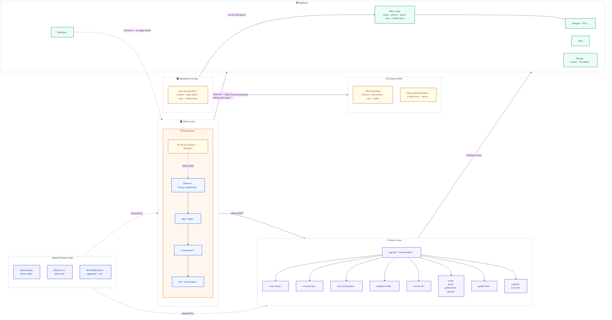

<p align="center">
  
</p>

<h1 align="center">MatchDay</h1>

<p align="center">
  <strong>Private World Cup 2026 prediction league</strong><br/>
  Predict every scoreline &nbsp;·&nbsp; Compete on a live leaderboard &nbsp;·&nbsp; Follow the prize pool
</p>

<p align="center">
  Built by <a href="https://github.com/aryan12singh">@aryan12singh</a> &nbsp;&amp;&nbsp; <a href="https://github.com/calebsooon">@calebsooon</a>
</p>

<p align="center">
  
  
  
  
  
  
</p>

<br/>

<p align="center">
  <a href="https://youtu.be/IPu3W5JPbZQ">
    
  </a><br/>
  <sub>▶ &nbsp;Click to watch the 150-second demo</sub>
</p>

<br/>

<p align="center">
  A private prediction league for FIFA World Cup 2026.<br/>
  Predict every scoreline, group order, and knockout bracket across 104 matches.<br/>
  Points settle instantly. The leaderboard updates live. The prize pool runs itself.
</p>

---

## Highlights

| | |
| :-- | :-- |
|  | **104 matches · 8 gameweeks.** Group stage through the final, fully predicted |
|  | **Granular scoring.** Outcome · exact score · goal diff · total goals · BTTS · first scorer (+4 pts) |
|  | **Zero-sum prize pool.** Per-GW and overall payouts settle automatically from a shared pot |
|  | **Live leaderboard.** Supabase Realtime pushes updates the moment a result lands |
|  | **Multi-league.** Private leagues with join codes; isolated standings per group of friends |
|  | **FIFA-backed match data.** Cached rosters · full-kit player images · team/player stats · confirmed lineups · Golden Boot · import freshness |
|  | **Gameweek stories.** Dynamic recaps, League Pulse, rank movement, xG upsets, and private share cards |
|  | **iCal feed.** Auto-updating per user; works in Google, Apple, Outlook, and Notion |
|  | **Installable.** iOS, Android, and desktop; offline shell with Workbox |
|  | **Colour-blind mode.** Okabe–Ito CVD-safe palette, scoped to chart or whole app; DB-synced |
|  | **RLS-hardened.** Predictions gated by kickoff time and league membership at the DB level |

---

## Contents

- [How it works](#how-it-works)
- [Scoring](#scoring)
- [Prize pool](#prize-pool)
- [Features](#features)
- [Screenshots](#screenshots)
- [Tech stack](#tech-stack)
- [Architecture](#architecture)
- [Local development](#local-development)
- [Deployment](#deployment)

---

## How it works

 **Join your league**

Sign up with email, enter your invite code, and you're in. Leagues are private and admin-created; each group of friends gets its own isolated standings and prize pool. Multiple leagues are supported.

 **Submit predictions before kickoff**

Head to **Fixtures** and enter your scoreline for each match. On top of the score, you can predict:

- **First-goal team** — which side opens the scoring
- **First scorer** — the specific player (highest reward, +4 pts)
- **Total goals** — an independent hedge that earns points even if the exact score is wrong
- **Goal difference** — a second hedge, togglable per league by the admin

Predictions lock at kickoff. The admin enters the result and every prediction is scored automatically across all per-category columns.

 **Compete across 8 gameweeks**

Points accumulate through the group stage and all knockout rounds. Supabase Realtime pushes leaderboard updates the moment results land, no refresh needed.

 **Predict the structure**

Beyond individual matches, predict group finishing orders (+2 per correct placement) and the full knockout bracket — champion, runner-up, semi-finalists, and quarter-finalists (up to +47 pts total).

 **The prize pool settles itself**

Each gameweek and the overall standings pay out and claw back based on finishing position. The dashboard shows your current rank, settled net, projected total, and best/worst prize range at all times.

---

## Scoring

### Match predictions &nbsp;&nbsp; 

| Category | Pts | Notes |
| :--- | :---: | :--- |
| Correct outcome (W / D / L) | **+3** | Always available |
| Exact scoreline | **+3** | Stacks with outcome |
| Correct goal difference | **+2** | Set independently of the scoreline |
| Correct total goals | **+1** | Set independently of the scoreline |
| Both teams to score — correct call | **+1** | Derived from your score prediction |
| Correct first-goal team | **+2** | Optional pick |
| Correct first scorer | **+4** | Optional pick — highest single reward |

> Total goals and goal difference are entered **separately** from the scoreline, so a well-placed hedge can bank points even when the exact score is wrong.

### Group predictions &nbsp;&nbsp; 

**+2** for each team placed in the correct group finishing position across 12 groups.

### Tournament bracket &nbsp;&nbsp; 

| Pick | Pts |
| :--- | :---: |
| Champion | **+15** |
| Runner-up | **+8** |
| Each correct semi-finalist (×2) | **+4** |
| Each correct quarter-finalist (×4) | **+2** |

---

## Prize pool

Zero-sum pool settled per gameweek (GW1–GW8) and overall at tournament end.

| Position | Per gameweek | Overall |
| :---: | :---: | :---: |
| 1st |  |  |
| 2nd |  |  |
| 3rd |  |  |
| 4th |  |  |
| 5th |  |  |
| 6th |  |  |
| 7th |  |  |

**Tiebreakers:** total points → most correct outcomes → most exact scorelines → shared rank.

<details>
<summary>Gameweek schedule</summary>

<br/>

| Gameweek | Stage |
| :--- | :--- |
| GW1 / GW2 / GW3 | Group Stage |
| GW4 | Round of 32 |
| GW5 | Round of 16 |
| GW6 | Quarter-finals |
| GW7 | Semi-finals |
| GW8 | Final + 3rd place play-off |

</details>

---

## Features

<details>
<summary><strong>Predictions &amp; gameplay</strong></summary>

<br/>

| Feature | Detail |
| :--- | :--- |
| Scoreline prediction | Home / away goals via stepper controls; locks at kickoff |
| First scorer pick | Choose from the full 26-man squad roster |
| Total goals &amp; goal diff | Independent hedges set separately from the scoreline |
| Own goal handling | Admin marks OG; excludes it from first-scorer scoring |
| Group order predictor | Drag-and-drop finishing predictions for all 12 groups |
| Knockout bracket | Pick champion, runner-up, semi-finalists, quarter-finalists |
| Per-league goal diff | Admin can enable or disable goal difference scoring per league |

</details>

<details>
<summary><strong>Fixtures &amp; results</strong></summary>

<br/>

| Feature | Detail |
| :--- | :--- |
| Filter tabs | Open · Today · Missing · Closed · Full — always know where to act |
| Points colour coding | `+N pts` pill turns green / amber / red based on % of max possible |
| Stage filter | All · Group Stage · Knockout — second filter row |
| Consensus reveal | After kickoff, every member's full prediction for that match is revealed |
| Prediction wall | See the whole league's pick distribution per match |
| Calendar export | Subscribe to or download fixtures as an iCalendar feed — auto-updating, timezone-aware, with a configurable reminder; works in Google, Apple, Outlook, and Notion |
| League Pulse | Reveal-safe crowd distributions, top scorelines, BTTS / goals read, scorer podium, and your majority / minority context |
| Match Centre | Expandable broadcast-style pitch with live score ribbon, team colours, announced-vs-current XI, unused benches, and match timeline |
| Match-page flow | Desktop section rail and mobile tabs keep prediction, lineups, stats, League Pulse, and picks easy to reach without a giant scroll |

</details>

<details>
<summary><strong>Live data</strong></summary>

<br/>

| Feature | Detail |
| :--- | :--- |
| FIFA Match Centre | Official fixtures, results, venue, officials, weather, team sheets, substitutions, and match stats cached into Supabase |
| Live lineups | Confirmed XI, bench, shirt numbers, formation, and verified substitutions rendered on a positional pitch |
| Match facts | Venue, officials, weather, attendance, score comparison, xG, and complete player match-stat grids |
| Injury flags | Out/suspended players flagged across squad views |
| FIFA team centre | 48 team cards, confederation filters, form, fixtures, tournament stats, and full-kit squad cards — all served from Supabase |
| Golden Boot | FIFA-published tournament scorers and assists, cached in Supabase with FIFA’s official ordering |
| Player enrichment | Headshots, clubs, and dates of birth sourced from Wikidata; self-hosted in Supabase Storage |
| Local sync | FIFA is read by manual local `npm run data:fifa:*` imports; every page reads only cached Supabase data |
| Import resilience | Sync runs track source freshness, records read/written, errors, raw FIFA match snapshots, and match-specific participant identity for safe replay/debugging |

</details>

<details>
<summary><strong>Leaderboard &amp; social</strong></summary>

<br/>

| Feature | Detail |
| :--- | :--- |
| Live leaderboard | Supabase Realtime; rank arrows ▲▼, point totals, prize column |
| Per-GW standings | Switch between overall and any individual gameweek |
| Gameweek recaps | Dynamic leader, climber, exact-score, consensus, prize, and xG storylines — private to the active league |
| Private sharing | Copy a formatted recap or generate a branded image / native share-sheet card without publishing league data |
| Head-to-head | Full H2H stats, win/draw/loss record, side-by-side points race chart |
| Achievement badges | Auto-calculated (Scoreline Sniper, Golden Boot Guru, Hot Hand, …) |
| Activity feed | Live league event stream on the dashboard |
| CSV export | Download the full leaderboard as a spreadsheet |

</details>

<details>
<summary><strong>Profile &amp; personalisation</strong></summary>

<br/>

| Feature | Detail |
| :--- | :--- |
| Profile page | Stats, accuracy by category, rank movement chart, GW breakdown, badge showcase |
| Avatar upload | Circular crop tool — drag to reposition, slider to zoom |
| Settled prize | Shows real GW earnings after each gameweek closes |
| Light / dark mode | Follows system preference; toggle available in the header |
| Colour-blind mode | CVD-safe (Okabe–Ito) palette, scoped to the leaderboard chart or the whole app; synced across devices |

</details>

<details>
<summary><strong>Admin</strong></summary>

<br/>

| Feature | Detail |
| :--- | :--- |
| Result entry | Score, first goal, first scorer, knockout winner, save, and rescore controls come first in every match card |
| Manual team sheets | Independently edit announced XI, bench, position, pitch row / lane, and verified in-match substitutions |
| FIFA sync cockpit | Shows FIFA fixture coverage, freshness, started-match lineup/stat coverage, missing-data counts, and copyable sync commands |
| Targeted repair | Missing started matches expose a copyable per-match lineup or stats refresh command; manual sheets always remain the correction path |
| Rank snapshots | Captured automatically after scoring for movement arrows |
| Rescore all | Full recompute — use after any rule or data correction |

</details>

<details>
<summary><strong>Platform</strong></summary>

<br/>

| Feature | Detail |
| :--- | :--- |
| PWA | Installable on iOS, Android, and desktop; offline shell |
| Teams centre | 48 FIFA-backed nation cards with confederation filters, form, fixtures, team leaders, and detailed squad profiles |
| Multi-league | Admin-created leagues with unique join codes; independent standings |
| Invite links | Shareable `?code=` links that pre-fill the join form |
| Mobile-first | Fully responsive; all pages optimised for PWA and phone use |

</details>

<details>
<summary><strong>Pages &amp; routes</strong></summary>

<br/>

| Route | Description |
| :--- | :--- |
| `/` | Landing page |
| `/login` | Email / password auth |
| `/dashboard` | Rank, stats, hero match, form strip, mini-leaderboard, prize outlook |
| `/predictions` | All fixtures with filters; quick-predict bottom sheet |
| `/match/[id]` | Prediction form, League Pulse, Match Centre, match facts, and prediction wall |
| `/groups` | Group finishing order predictor (all 12 groups) |
| `/bracket` | Full knockout bracket and tournament picks |
| `/leaderboard` | Live standings, per-GW view, rank movement, CSV export |
| `/h2h` | Head-to-head compare — pick any two members |
| `/squads` | Teams centre — FIFA squads, form, fixtures, tournament leaders, and player cards |
| `/golden-boot` | Tournament top scorers and assists |
| `/recap?gw=<1–8>` | Private gameweek story, rank movement, match moments, and share actions |
| `/profile` | Stats, accuracy, rank chart, badges, bracket and group picks |
| `/rules` | Scoring rules reference |
| `/admin` | FIFA sync cockpit, result entry, lineup positioning, substitutions, and scoring actions |

</details>

---

## Screenshots

### Landing & Dashboard


<details>
<summary><strong>Core gameplay</strong></summary>

<br/>

| Fixtures (dark) | Fixtures — group filter (light) |
|---|---|
|  |  |

| Predict a match | Scored match — league predictions revealed |
|---|---|
|  |  |


</details>

<details>
<summary><strong>Standings &amp; competition</strong></summary>

<br/>


| Tournament bracket | Group predictor |
|---|---|
|  |  |

</details>

<details>
<summary><strong>Mobile (PWA)</strong></summary>

<br/>

| Fixtures | Home &amp; navigation |
|---|---|
|  |  |

</details>

<details>
<summary><strong>More screenshots</strong></summary>

<br/>

| Profile | Head-to-head comparison |
|---|---|
|  |  |

| Squad browser | Golden Boot |
|---|---|
|  |  |

| Calendar export | Profile settings &amp; colour-blind mode |
|---|---|
|  |  |

| Admin — result entry | Admin — console |
|---|---|
|  |  |

| PWA install guide |  |
|---|---|
|  | |

</details>

---

## Tech stack

| | Layer | Technology |
| :---: | :--- | :--- |
|  | **Framework** | Next.js 15 — App Router, server and client components, API route handlers |
|  | **Language** | TypeScript in strict mode throughout |
|   | **UI** | React 18, Tailwind CSS with CSS-variable design tokens (light/dark via `.dark` on `<html>`) |
|  | **Database** | Supabase Postgres with Row Level Security — prediction visibility scoped by kickoff time and league membership |
|  | **Auth** | Supabase Auth — email/password; `middleware.ts` guards every route except `/login` |
|  | **Realtime** | Supabase Realtime — leaderboard updates push to all clients the moment a result is scored |
|  | **Storage** | Supabase Storage — avatars plus a cached `fifa-media` library for player images, flags, and team artwork |
|  | **PWA** | `@ducanh2912/next-pwa` with Workbox service worker, offline shell, and app badge |
|  | **Hosting** | Vercel — auto-deploys on every push to `main` |
|  | **Tournament data** | FIFA GameDay schedule, team sheets, match stats, media, and official Golden Boot ordering; imported locally and cached in Supabase |
|  | **Calendar** | RFC 5545 iCalendar feeds — auto-updating, timezone-aware; works in Google, Apple, Outlook, Notion |
| | **Accessibility** | Colour-blind-safe palette mode (Okabe–Ito), DB-backed and synced across devices |
| | **Design** | Schibsted Grotesk typeface, token-driven colour scheme, custom SVG charts — no chart library |

---

## Architecture



**Data flow**

1. User submits a prediction → client writes to `predictions` via supabase-js (RLS enforces own-row-only writes; predictions hidden from other members until kickoff)
2. Admin enters a result → POST to `/api/score-match` → reads point values from `lib/scoring.ts`, computes per-category breakdown, writes back to each `predictions` row
3. `lib/leaderboard.ts` aggregates scored predictions — shared between the dashboard mini-table and `/leaderboard`
4. `lib/prizes.ts` derives the prize snapshot from aggregated standings
5. Supabase Realtime pushes `predictions` UPDATE events to all connected clients — standings update instantly with no page reload
6. FIFA GameDay and FIFA’s published tables are fetched by local `npm run data:fifa:*` scripts. The importer writes fixtures, team sheets, substitutions, media, team/player match stats, Golden Boot rows, source snapshots, and sync-run health to Supabase; page views never call FIFA.

<details>
<summary>Project structure</summary>

```
app/
  page.tsx                  Landing page
  login/                    Email/password auth
  dashboard/                Rank, stats, hero match, form strip, prize outlook, activity feed
  predictions/              Fixtures list with filters and quick-predict bottom sheet
  match/[id]/               Prediction form, League Pulse, Match Centre, and match facts
  groups/                   Group order predictor (all 12 groups)
  bracket/                  Knockout bracket and tournament picks
  leaderboard/              Live standings, per-GW view, rank arrows, CSV export
  h2h/                      Head-to-head compare with stats and points race chart
  squads/                   FIFA Teams centre — form, fixtures, team leaders, and squad cards
  golden-boot/              Tournament top scorers and assists
  recap/                    Private gameweek recap and share actions
  profile/                  Stats, accuracy, rank chart tabs, badges, avatar crop
  rules/                    Scoring rules reference
  admin/                    FIFA sync cockpit, results, lineup positioning, and scoring (is_admin guard)
  api/
    score-match/            Score one match and trigger Realtime
    score-groups/           Score group finishing predictions
    score-tournament/       Score bracket predictions
    snapshot-ranks/         Capture rank snapshot
    rescore-all/            Full recompute of all scored predictions
    golden-boot/            Serve top scorers / assists from cache
    recap/                  Active-league-scoped gameweek recap data
    teams/                  Cached FIFA team list and team-detail data
    calendar/[token]/       Per-user iCalendar fixture feed

components/
  AppShell.tsx              Desktop sidebar, mobile bottom nav, theme toggle
  ui.tsx                    Design system — Button, Card, StatCard, Pill, Avatar,
                            ScoreStepper, Countdown, Modal, CountUp, icons, Logo
  football.tsx              MatchCard, NextPredictCard, LeaderboardTable
  FlagChip.tsx              Flag images for all 48 nations
  charts.tsx                BarChart, AreaChart, RankLine — SVG only, no chart library
  RulesContent.tsx          Shared rules copy used by RulesModal and /rules

lib/
  scoring.ts                Single source of truth for all point values
  prizes.ts                 Prize pool constants and computePrizeSnapshot
  leaderboard.ts            aggregateLeaderboard — shared aggregation and canonical sort
  normalize.ts              Universal ASCII name folding (Turkish, Nordic, Polish, …)
  league.ts                 getMyLeagues, isMoneyLeague, multi-league helpers
  teams.ts                  48 WC2026 teams with code, name, flag, and playerKey
  gameweek-recap.ts         Dynamic recap, match-story, headline, and share-text builder
  league-read.ts            Reveal-safe League Pulse distributions and personal context
  lineup-state.ts           Pure announced-XI and verified-substitution resolver
  team-match.ts             External team/player name → our codes and roster matching
  ics.ts                    RFC 5545 iCalendar builder for the fixture feed
  supabase-browser.ts       Browser Supabase client (anon key)
  supabase-server.ts        Server Supabase client (service role, RSC)

supabase/migrations/        SQL migrations applied in filename order via supabase db push
scripts/
  fetch-players.ts          Pulls WC2026 squads from football-data.org
  fetch-wikidata-players.ts Enriches players with photos, clubs, and DOBs from Wikidata
  cache-player-photos.ts    Downloads Wikimedia photos and re-hosts in Supabase Storage
  fill-missing-photos.ts    Optional legacy gap-fill for remaining player photos
  sync-golden-boot.ts       Cache FIFA’s official scorer / assist table into Supabase
  sync-fifa-teams.ts        Cache FIFA team, roster, player-stat, flag, and full-kit media data
  sync-fifa-matches.ts      Cache FIFA fixtures, results, team sheets, substitutions, and match stats
  sync-runs.ts              Shared import-run lifecycle and structured health metadata
  cache-team-crests.ts      Cache FIFA team artwork in Supabase Storage
  grant-admin.ts            Bootstrap the first organizer account
  setup-check.ts            Schema, connectivity, and launch-readiness check
.github/workflows/
  live-data.yml             Manual GitHub Action for prediction reminders only
middleware.ts               Redirects unauthenticated users to /login for all routes
```

</details>

---

## Local development

###  Clone and install

```bash
git clone <your-repository-url>
cd wc26-predictor
npm ci
```

###  Environment variables

```bash
cp .env.example .env.local
```

Open `.env.local` and fill in your values. Required fields are marked below:

```env
# Required
NEXT_PUBLIC_SUPABASE_URL=https://<your-project-ref>.supabase.co
NEXT_PUBLIC_SUPABASE_ANON_KEY=<your-anon-key>
SUPABASE_SERVICE_ROLE_KEY=<your-service-role-key>   # server-only — never commit
NEXT_PUBLIC_SITE_URL=http://localhost:3000

# Optional — legacy fallback / enrichment only
KICKOFF_API_KEY=<kickoffapi-key>                    # only for legacy fallback scripts and photo gap-filling
FOOTBALL_API_TOKEN=<football-data.org-key>          # only for legacy roster seeding

# Optional — GitHub Actions manual sync trigger
CRON_SECRET=<random-string>                         # server-only — never commit

# Optional — browser push notifications
NEXT_PUBLIC_VAPID_PUBLIC_KEY=<public-key>
VAPID_PRIVATE_KEY=<private-key>                     # server-only — never commit
VAPID_EMAIL=mailto:<you@example.com>

# Optional — public footer link
NEXT_PUBLIC_GITHUB_URL=https://github.com/<owner>/<repo>
```

###  Apply migrations

```bash
brew install supabase/tap/supabase   # macOS — see supabase.com/docs for other platforms
supabase login
supabase link --project-ref <your-project-ref>
supabase db push
```

###  Create the first organizer

Sign up once at `http://localhost:3000/login`. The Auth trigger creates a non-privileged profile automatically. Grant the organizer role:

```bash
ADMIN_EMAIL=you@example.com npm run bootstrap:admin
ADMIN_EMAIL=you@example.com npm run setup:check
```

###  Populate the FIFA team cache

```bash
npm run data:fifa-teams  # Required — 48 squads, team/player stats, flags, and cached full-kit images
npm run data:team-crests # Optional — cache FIFA team artwork in fifa-media
```

<details>
<summary>Legacy enrichment commands</summary>

<br/>

```bash
npm run data:players     # Historical football-data.org roster seed
npm run data:enrich      # Wikidata clubs, DOBs, and photos
npm run data:photos      # Re-host Wikimedia photos in Supabase Storage
npm run data:fill-photos # Optional final photo gap-fill
```

</details>

###  FIFA match-centre sync

Match data is imported from FIFA GameDay by scripts run **from your local machine**. The import stores the official fixture schedule, results, venue and referee details, confirmed team sheets, substitutions, and rich team/player match stats in Supabase. Page loads never call FIFA.

```bash
npm run data:fifa-teams     # one-time / occasional: 48 squads, player images, and team stats
npm run data:fifa:team-stats # faster team/roster/stat refresh without image downloads
npm run data:team-crests    # optional: cache FIFA team artwork in fifa-media
npm run data:fifa:fixtures  # all 104 fixture IDs, schedule, status, result, venue metadata
npm run data:fifa:lineups   # nearby published team sheets and verified substitutions
npm run data:fifa:stats     # nearby team and player match-stat packs
npm run data:fifa:backfill  # one-time: every published lineup, substitution, and stat pack
npm run data:fifa:bootstrap # one-time complete FIFA bootstrap: teams, historical match centre, Golden Boot
npm run data:fifa:daily     # daily: nearby match-centre updates + FIFA Golden Boot
npm run data:fifa:refresh   # fixtures + nearby match centre + Golden Boot
npm run data:fifa:matches   # one incremental nearby-match refresh (without Golden Boot)
FIFA_SYNC_MODE=all MATCH_ID=<uuid> npm run data:fifa:match # one selected match, ideal after a correction
npm run data:live           # alias for data:fifa:daily
```

Run `npm run data:fifa:bootstrap` once after applying the FIFA Match Centre and operations migrations. Afterwards use `npm run data:fifa:daily` for a fast routine refresh, `npm run data:fifa:refresh` before/after a fuller matchday, or the copied command in **Admin → FIFA sync cockpit** to repair one specific match. Every command writes an import record with freshness and failure detail; admin result entry and manual lineup positioning remain the correction path when FIFA has not published a field yet.

###  Verify and run

```bash
npm run setup:check  # schema, connectivity, and configured launch features
npm run check        # lint, typecheck, unit tests, and production build
npm run dev          # development server → http://localhost:3000
```

> **PWA note:** the service worker is disabled in development. To test offline behaviour, run `npm run build && npm start` and open DevTools → Application → Service Workers → **Offline**.

---

## Deployment

| Step | Action |
| :---: | :--- |
| 1 | Create a hosted Supabase project, run `supabase db push`, and add `http://localhost:3000/auth/callback` + `https://<your-domain>/auth/callback` under **Authentication → URL Configuration**. |
| 2 | Sign up once, run `ADMIN_EMAIL=<email> npm run bootstrap:admin`, create a private league, and confirm a second account can join only via its invite code. |
| 3 | Import the repository in [Vercel](https://vercel.com). Add every value from `.env.example`; set `NEXT_PUBLIC_SITE_URL` to your production domain. |
| 4 | In GitHub **Settings → Secrets → Actions**, add `APP_URL=https://<your-domain>` and `CRON_SECRET`. Use **Run workflow** on the Actions tab to manually trigger a live-data sync. |
| 5 | Deploy, then run `ADMIN_EMAIL=<email> npm run setup:check` against the production URL. |

---

## Launch checklist

- `npm ci`, `supabase db push`, `npm run setup:check`, and `npm run check` all pass cleanly
- A normal account cannot change `is_admin`, read a league's join code directly, add itself to a league, or update match data
- The first organizer is created only via `npm run bootstrap:admin`
- Test a locked prediction, the formation pitch, result scoring, calendar token, and the LinkedIn Open Graph preview
- Confirm live data by running `npm run data:live` from your local machine after a match finishes
- Check **Admin → FIFA sync cockpit** after every refresh: freshness, coverage, import writes, and missing started matches should all be green

---

## Launch notes

MatchDay is a private-league product, not a public demo. It stores email-auth accounts, optional public avatars, browser push subscriptions, and revocable calendar-feed tokens. The in-app [Privacy](/privacy) and [Terms](/terms) pages describe those surfaces. This is an independent fan project and is not affiliated with FIFA.

---

<p align="center">
  <sub>Built for WC2026 &nbsp;·&nbsp; Private league &nbsp;·&nbsp; Not affiliated with FIFA</sub><br/>
  <sub>Built by <a href="https://github.com/aryan12singh">@aryan12singh</a> &nbsp;&amp;&nbsp; <a href="https://github.com/calebsooon">@calebsooon</a></sub>
</p>
