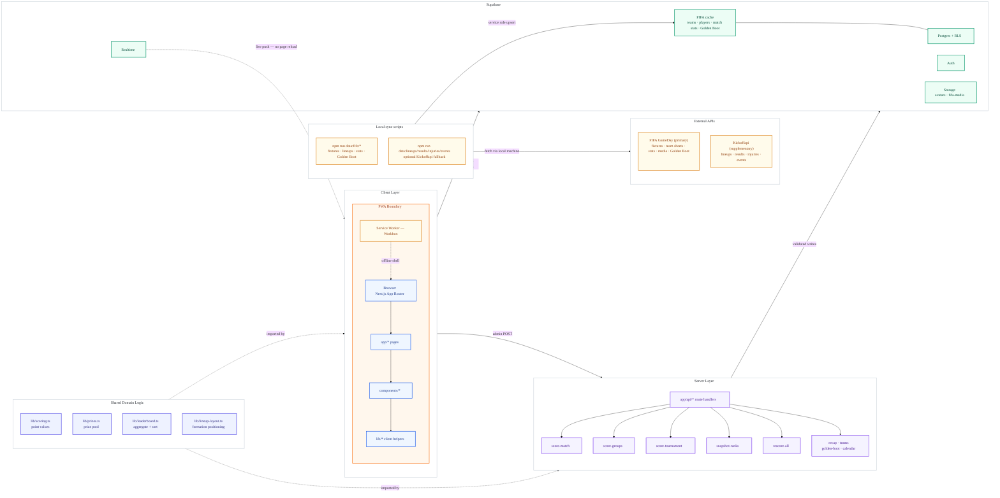

<p align="center">
  
</p>

<h1 align="center">MatchDay</h1>

<p align="center">
  <strong>Private World Cup 2026 prediction league</strong><br/>
  Predict every scoreline &nbsp;·&nbsp; Compete on a live leaderboard &nbsp;·&nbsp; Follow the prize pool
</p>

<p align="center">
  Built by <a href="https://github.com/aryan12singh">@aryan12singh</a> &nbsp;&amp;&nbsp; <a href="https://github.com/calebsooon">@calebsooon</a>
</p>

<p align="center">
  
  
  
  
  
  
</p>

<br/>

<p align="center">
  <a href="https://youtu.be/IPu3W5JPbZQ">
    
  </a><br/>
  <sub>&#9654; &nbsp;Click to watch the 150-second demo</sub>
</p>

<br/>

<p align="center">
  A private prediction league for FIFA World Cup 2026.<br/>
  Predict every scoreline, group order, and knockout bracket across 104 matches.<br/>
  Points settle instantly. The leaderboard updates live. The prize pool runs itself.
</p>

---

## Highlights

| | |
| :-- | :-- |
|  | **104 matches · 8 gameweeks.** Group stage through the final, fully predicted |
|  | **Granular scoring.** Outcome · exact score · goal diff · total goals · BTTS · first scorer (+4 pts) |
|  | **Zero-sum prize pool.** Per-GW and overall payouts settle automatically from a shared pot |
|  | **Live leaderboard.** Supabase Realtime pushes updates the moment a result lands |
|  | **Multi-league.** Private leagues with join codes; isolated standings per group of friends |
|  | **Broadcast-style pitch.** Formation-first XI layout, kit-coloured player tokens, verified substitutions, tactical shape changes, and match events on a live positional pitch |
|  | **FIFA-backed match data.** Cached rosters · full-kit player images · team/player stats · confirmed lineups · Golden Boot · import freshness |
|  | **Gameweek stories.** Dynamic recaps, League Pulse, rank movement, xG upsets, and private share cards |
|  | **iCal feed.** Auto-updating per user; works in Google, Apple, Outlook, and Notion |
|  | **Installable.** iOS, Android, and desktop; offline shell with Workbox |
|  | **Colour-blind mode.** Okabe–Ito CVD-safe palette, scoped to chart or whole app; DB-synced |
|  | **RLS-hardened.** Predictions gated by kickoff time and league membership at the DB level |

---

## Contents

- [How it works](#how-it-works)
- [Scoring](#scoring)
- [Prize pool](#prize-pool)
- [Features](#features)
- [Screenshots](#screenshots)
- [Tech stack](#tech-stack)
- [Architecture](#architecture)
- [Local development](#local-development)
- [Data commands](#data-commands)
- [Deployment](#deployment)

---

## How it works

 **Join your league**

Sign up with email, enter your invite code, and you're in. Leagues are private and admin-created; each group of friends gets its own isolated standings and prize pool. Multiple leagues are supported.

 **Submit predictions before kickoff**

Head to **Fixtures** and enter your scoreline for each match. On top of the score, you can predict:

- **First-goal team** — which side opens the scoring
- **First scorer** — the specific player (highest reward, +4 pts)
- **Total goals** — an independent hedge that earns points even if the exact score is wrong
- **Goal difference** — a second hedge, togglable per league by the admin

Predictions lock at kickoff. The admin enters the result and every prediction is scored automatically across all per-category columns.

 **Compete across 8 gameweeks**

Points accumulate through the group stage and all knockout rounds. Supabase Realtime pushes leaderboard updates the moment results land, no refresh needed.

 **Predict the structure**

Beyond individual matches, predict group finishing orders (+2 per correct placement) and the full knockout bracket — champion, runner-up, semi-finalists, and quarter-finalists (up to +47 pts total).

 **The prize pool settles itself**

Each gameweek and the overall standings pay out and claw back based on finishing position. The dashboard shows your current rank, settled net, projected total, and best/worst prize range at all times.

---

## Scoring

### Match predictions &nbsp;&nbsp; 

| Category | Pts | Notes |
| :--- | :---: | :--- |
| Correct outcome (W / D / L) | **+3** | Always available |
| Exact scoreline | **+3** | Stacks with outcome |
| Correct goal difference | **+2** | Set independently of the scoreline |
| Correct total goals | **+1** | Set independently of the scoreline |
| Both teams to score — correct call | **+1** | Derived from your score prediction |
| Correct first-goal team | **+2** | Optional pick |
| Correct first scorer | **+4** | Optional pick — highest single reward |

> Total goals and goal difference are entered **separately** from the scoreline, so a well-placed hedge can bank points even when the exact score is wrong.

### Group predictions &nbsp;&nbsp; 

**+2** for each team placed in the correct group finishing position across 12 groups.

### Tournament bracket &nbsp;&nbsp; 

| Pick | Pts |
| :--- | :---: |
| Champion | **+15** |
| Runner-up | **+8** |
| Each correct semi-finalist (×2) | **+4** |
| Each correct quarter-finalist (×4) | **+2** |

---

## Prize pool

Zero-sum pool settled per gameweek (GW1–GW8) and overall at tournament end.

| Position | Per gameweek | Overall |
| :---: | :---: | :---: |
| 1st |  |  |
| 2nd |  |  |
| 3rd |  |  |
| 4th |  |  |
| 5th |  |  |
| 6th |  |  |
| 7th |  |  |

**Tiebreakers (in order):** total points → correct outcomes → exact scorelines → correct goal differences → correct total goals → correct BTTS calls → correct first-goal team → correct first scorer → predictions submitted → shared rank if still equal.

<details>
<summary>Gameweek schedule</summary>

<br/>

| Gameweek | Stage |
| :--- | :--- |
| GW1 / GW2 / GW3 | Group Stage |
| GW4 | Round of 32 |
| GW5 | Round of 16 |
| GW6 | Quarter-finals |
| GW7 | Semi-finals |
| GW8 | Final + 3rd place play-off |

</details>

---

## Features

<details>
<summary><strong>Predictions &amp; gameplay</strong></summary>

<br/>

| Feature | Detail |
| :--- | :--- |
| Scoreline prediction | Home / away goals via stepper controls; locks at kickoff |
| First scorer pick | Full-screen card modal — search the 26-man squad, or pick "No scorer" / "Own goal" |
| Total goals &amp; goal diff | Independent hedges set separately from the scoreline |
| Own goal handling | Admin marks OG; excluded from first-scorer scoring |
| Group order predictor | Drag-and-drop finishing predictions for all 12 groups |
| Knockout bracket | Pick champion, runner-up, semi-finalists, quarter-finalists |
| Per-league goal diff | Admin can enable or disable goal difference scoring per league |
| Quick-predict sheet | Bottom sheet on the Fixtures page for fast in-line prediction without leaving the list |

</details>

<details>
<summary><strong>Match Centre</strong></summary>

<br/>

| Feature | Detail |
| :--- | :--- |
| Positional pitch | Broadcast-style pitch rendered with kit-coloured player tokens scaled to the pitch container; tap any token to open a player detail sheet |
| Formation-first rendering | FIFA tactics resolve full formations — including back threes, wing-backs, five-at-the-back, pivots, diamonds, and narrow systems — into balanced tactical rows using `lib/lineup-layout.ts` |
| Provider-resilient placement | Side-specific roles such as `LCB` / `RCB` and `LWB` / `RWB` are classified correctly; an incomplete team sheet retains its intended formation depth rather than compressing into the available rows |
| Player tokens | Silhouette or official headshot, shirt number, surname plate, goal ball / yellow card indicators, and GK colour dot |
| Confirmed XI vs bench | Starting XI on pitch; substitutes listed below in a responsive grid. Dense four-/five-player lines automatically use more compact tokens for clear spacing |
| Substitution events | Verified in-match subs replace the outgoing player in their exact pitch slot, with minute and player-in/out preserved |
| Tactical shape changes | The latest verified formation change powers the Current XI; shape changes sit alongside goals, cards, and substitutions in the match timeline |
| Match events timeline | Goals, yellow cards, red cards, substitutions, and tactical changes are shown per team with minute |
| Match facts panel | Venue, officials, weather, attendance, xG, shots, possession, passes, fouls, corners, and full player match-stat grids |
| Focus view | Fullscreen pitch overlay for immersive viewing |
| Live Supabase sync | Lineup and event data updates in real time without a page reload |

</details>

<details>
<summary><strong>Fixtures &amp; results</strong></summary>

<br/>

| Feature | Detail |
| :--- | :--- |
| Filter tabs | Open · Today · Missing · Closed · Full — always know where to act |
| Points colour coding | Points pill turns green / amber / red based on percentage of max possible |
| Stage filter | All · Group Stage · Knockout — second filter row |
| Consensus reveal | After kickoff, every member's full prediction for that match is visible |
| Prediction wall | See the whole league's pick distribution, scorer choices, and points breakdown per match |
| Calendar export | Subscribe to or download fixtures as an iCalendar feed — auto-updating, timezone-aware, with a configurable reminder; works in Google, Apple, Outlook, and Notion |
| League Pulse | Reveal-safe crowd distributions, top scorelines, BTTS / goals read, scorer podium, and your majority / minority context |
| Match-page layout | Desktop section rail (Match Centre → Match Stats → League Pulse → Everyone's Picks) and mobile tab bar; prediction form is always one tap away |

</details>

<details>
<summary><strong>Live data</strong></summary>

<br/>

| Feature | Detail |
| :--- | :--- |
| FIFA Match Centre | Official fixtures, results, venue, officials, weather, team sheets, substitutions, and match stats cached into Supabase |
| Live lineups | Confirmed XI, bench, shirt numbers, FIFA formation, manual formation overrides, verified substitutions, and tactical shape changes rendered on a positional pitch |
| Match facts | Venue, officials, weather, attendance, score comparison, xG, and complete player match-stat grids |
| Injury flags | Out / suspended players flagged across squad views |
| FIFA Teams centre | 48 team cards, confederation filters, form, fixtures, tournament stats, and full-kit squad cards — all served from Supabase |
| Golden Boot | FIFA-published tournament scorers and assists, cached in Supabase with FIFA's official ordering |
| Player enrichment | Headshots, clubs, and dates of birth sourced from Wikidata; self-hosted in Supabase Storage |
| Local sync | All data is imported by local `npm run data:*` scripts from your machine; every page reads only cached Supabase data — the live app never calls FIFA or Kickoffapi directly |
| Import resilience | Sync runs record freshness, rows read/written, errors, raw FIFA match snapshots, and per-match identity for safe replay and debugging |

</details>

<details>
<summary><strong>Leaderboard &amp; social</strong></summary>

<br/>

| Feature | Detail |
| :--- | :--- |
| Live leaderboard | Supabase Realtime; rank arrows &#9650;&#9660;, point totals, prize column |
| Per-GW standings | Switch between overall and any individual gameweek |
| Points race chart | Multi-line area chart tracking cumulative points across gameweeks for all members |
| Gameweek recaps | Dynamic leader, climber, exact-score, consensus, prize, and xG storylines — private to the active league |
| Private sharing | Copy a formatted recap or generate a branded share card without publishing league data |
| Head-to-head | Full H2H stats, win/draw/loss record, and side-by-side points race chart |
| Achievement badges | Auto-calculated (Scoreline Sniper, Golden Boot Guru, Hot Hand, …) |
| Activity feed | Live league event stream on the dashboard |
| CSV export | Download the full leaderboard as a spreadsheet |

</details>

<details>
<summary><strong>Profile &amp; personalisation</strong></summary>

<br/>

| Feature | Detail |
| :--- | :--- |
| Profile page | Stats, accuracy by category, rank movement chart, GW breakdown, badge showcase |
| Avatar upload | Circular crop tool — drag to reposition, slider to zoom |
| Settled prize | Shows real GW earnings after each gameweek closes |
| Light / dark mode | Follows system preference; toggle available in the header |
| Colour-blind mode | CVD-safe (Okabe–Ito) palette, scoped to the leaderboard chart or the whole app; synced across devices |

</details>

<details>
<summary><strong>Admin</strong></summary>

<br/>

| Feature | Detail |
| :--- | :--- |
| Result entry | Score, first goal, first scorer, knockout winner, save, and rescore controls |
| Manual team sheets | Independently edit announced XI, bench, and position with an immediate team preview plus an on-demand full two-team pitch shared with the public Match Centre resolver |
| Formation controls | Keep FIFA as the default, optionally set a per-team formation override, or return to the provider shape at any time |
| Tactical changes | Record, inline-edit, or remove a team&apos;s formation switch at a minute; the latest verified shape drives the Current XI pitch and timeline |
| Lineup checks | Save-time checks flag non-11-player XIs, missing / duplicate goalkeepers, incomplete positions, and suspicious back-line / attacking-shape mismatches before an admin confirms the sheet |
| Manual grid override | Formation-first layout is the default; switch to manual grid only when a specific player needs a precise row or left/right lane |
| FIFA sync cockpit | Shows FIFA fixture coverage, freshness, started-match lineup / stat coverage, missing-data counts, and copyable per-match sync commands |
| Targeted repair | Missing started matches expose a copyable per-match command; manual sheets remain the correction path when FIFA has not published a field yet |
| Rank snapshots | Captured automatically after scoring for movement arrows |
| Bracket results | Entry panel for knockout round advancement, positioned separately from match scoring |
| Rescore all | Full recompute — use after any rule or data correction |

</details>

<details>
<summary><strong>Platform</strong></summary>

<br/>

| Feature | Detail |
| :--- | :--- |
| PWA | Installable on iOS, Android, and desktop; offline shell with guided install page at `/install` |
| Multi-league | Admin-created leagues with unique join codes; independent standings per group |
| Invite links | Shareable `?code=` links that pre-fill the join form |
| Command palette | Global keyboard-driven navigation across all pages |
| FAQ | In-app answers to common questions at `/faq` |
| Mobile-first | Fully responsive; all pages optimised for PWA and phone use |

</details>

<details>
<summary><strong>Pages &amp; routes</strong></summary>

<br/>

| Route | Description |
| :--- | :--- |
| `/` | Landing page |
| `/login` | Email / password auth |
| `/dashboard` | Rank, stats, hero match, form strip, mini-leaderboard, prize outlook, activity feed |
| `/predictions` | All fixtures with filters; quick-predict bottom sheet |
| `/match/[id]` | Prediction form, Match Centre (pitch + facts), League Pulse, and prediction wall |
| `/groups` | Group finishing order predictor (all 12 groups) |
| `/bracket` | Full knockout bracket and tournament picks |
| `/leaderboard` | Live standings, per-GW view, points race chart, rank movement, CSV export |
| `/h2h` | Head-to-head compare — pick any two members |
| `/squads` | Teams centre — FIFA squads, form, fixtures, tournament leaders, stat leaders, and player cards |
| `/golden-boot` | Tournament top scorers and assists |
| `/recap?gw=<1–8>` | Private gameweek story, rank movement, match moments, and share actions |
| `/profile` | Stats, accuracy, rank chart, badges, bracket and group picks |
| `/rules` | Scoring rules reference |
| `/admin` | FIFA sync cockpit, result entry, formation controls, live lineup preview, tactical changes, substitutions, and scoring actions |
| `/join` | League join form; pre-filled via `?code=` invite links |
| `/install` | Guided PWA install instructions for iOS, Android, and desktop |
| `/faq` | In-app frequently asked questions |
| `/privacy` | Privacy policy |
| `/terms` | Terms of service |

</details>

---

## Screenshots

### Landing & Dashboard


<details>
<summary><strong>Core gameplay</strong></summary>

<br/>

| Fixtures (dark) | Fixtures — group filter (light) |
|---|---|
|  |  |

| Predict a match | Scored match — league predictions revealed |
|---|---|
|  |  |


</details>

<details>
<summary><strong>Standings &amp; competition</strong></summary>

<br/>


| Tournament bracket | Group predictor |
|---|---|
|  |  |

</details>

<details>
<summary><strong>Mobile (PWA)</strong></summary>

<br/>

| Fixtures | Home &amp; navigation |
|---|---|
|  |  |

</details>

<details>
<summary><strong>More screenshots</strong></summary>

<br/>

| Profile | Head-to-head comparison |
|---|---|
|  |  |

| Squad browser | Golden Boot |
|---|---|
|  |  |

| Calendar export | Profile settings &amp; colour-blind mode |
|---|---|
|  |  |

| Admin — result entry | Admin — console |
|---|---|
|  |  |

| PWA install guide | |
|---|---|
|  | |

</details>

---

## Tech stack

| | Layer | Technology |
| :---: | :--- | :--- |
|  | **Framework** | Next.js 15 — App Router, server and client components, API route handlers |
|  | **Language** | TypeScript in strict mode throughout |
|   | **UI** | React 18, Tailwind CSS with CSS-variable design tokens (light/dark via `.dark` on `<html>`), Framer Motion for pitch animations |
|  | **Database** | Supabase Postgres with Row Level Security — prediction visibility scoped by kickoff time and league membership |
|  | **Auth** | Supabase Auth — email/password; `middleware.ts` guards every route except `/login` |
|  | **Realtime** | Supabase Realtime — leaderboard and lineup updates push to all clients without a page reload |
|  | **Storage** | Supabase Storage — avatars plus a cached `fifa-media` library for player images, flags, and team artwork |
|  | **PWA** | `@ducanh2912/next-pwa` with Workbox service worker, offline shell, and app badge |
|  | **Hosting** | Vercel — auto-deploys on every push to `main` |
|  | **Tournament data** | FIFA GameDay schedule, team sheets, match stats, media, and official Golden Boot ordering; imported locally and cached in Supabase |
|  | **Calendar** | RFC 5545 iCalendar feeds — auto-updating, timezone-aware; works in Google, Apple, Outlook, Notion |
| | **Charts** | Custom SVG charts — BarChart, AreaChart, RankLine, RaceCompareChart — no third-party chart library |
| | **Accessibility** | Colour-blind-safe palette mode (Okabe–Ito), DB-backed and synced across devices |
| | **Design** | Schibsted Grotesk typeface, token-driven colour scheme, custom SVG icons throughout |

---

## Architecture



**Data flow**

1. User submits a prediction → client writes to `predictions` via supabase-js (RLS enforces own-row-only writes; predictions are hidden from other members until kickoff)
2. Admin enters a result → POST to `/api/score-match` → reads point values from `lib/scoring.ts`, computes per-category breakdown, writes back to each `predictions` row
3. `lib/leaderboard.ts` aggregates scored predictions — shared between the dashboard mini-table and `/leaderboard`
4. `lib/prizes.ts` derives the prize snapshot from aggregated standings
5. Supabase Realtime pushes `predictions` UPDATE events to all connected clients — standings update instantly with no page reload
6. FIFA GameDay is the primary data source — local `npm run data:fifa:*` scripts write fixtures, team sheets, substitutions, media, match stats, Golden Boot rows, and sync-run health to Supabase. Kickoffapi scripts (`data:lineups`, `data:results`, `data:injuries`, `data:events`) are a residential-only supplementary fallback. Page views never call either API directly.

<details>
<summary>Project structure</summary>

```
app/
  page.tsx                  Landing page
  login/                    Email/password auth
  dashboard/                Rank, stats, hero match, form strip, prize outlook, activity feed
  predictions/              Fixtures list with filters and quick-predict bottom sheet
  match/[id]/               Prediction form, Match Centre, League Pulse, match facts, prediction wall
  groups/                   Group order predictor (all 12 groups)
  bracket/                  Knockout bracket and tournament picks
  leaderboard/              Live standings, per-GW view, points race chart, rank arrows, CSV export
  h2h/                      Head-to-head compare with stats and points race chart
  squads/                   FIFA Teams centre — form, fixtures, stat leaders, and squad cards
  golden-boot/              Tournament top scorers and assists
  recap/                    Private gameweek recap and share actions
  profile/                  Stats, accuracy, rank chart tabs, badges, avatar crop
  rules/                    Scoring rules reference
  admin/                    FIFA sync cockpit, results, lineup positioning, and scoring (is_admin guard)
  join/                     League join — pre-filled from invite ?code= links
  install/                  Guided PWA install instructions per platform
  faq/                      Frequently asked questions
  api/
    score-match/            Score one match and trigger Realtime
    score-groups/           Score group finishing predictions
    score-tournament/       Score bracket predictions
    snapshot-ranks/         Capture rank snapshot after scoring
    rescore-all/            Full recompute of all scored predictions
    golden-boot/            Serve top scorers / assists from cache
    recap/                  Active-league-scoped gameweek recap data
    teams/[code]/           Cached FIFA team list and per-team detail
    calendar/[token]/       Per-user iCalendar fixture feed

components/
  AppShell.tsx              Desktop sidebar, mobile bottom nav, theme toggle
  ui.tsx                    Design system — Button, Card, StatCard, Pill, Avatar,
                            ScoreStepper, Countdown, Modal, CountUp, icons, Logo
  football.tsx              MatchCard, NextPredictCard, LeaderboardTable
  MatchLineups.tsx          Positional pitch with kit-coloured player tokens, substitutions, and events
  MatchFacts.tsx            Venue, officials, weather, xG, shots, possession, player stat grids
  PlayerCardPicker.tsx      Full-screen card modal for first-scorer selection
  PredictionModal.tsx       Quick-predict bottom sheet used from the Fixtures page
  LeagueRead.tsx            League Pulse — reveal-safe pick distributions and personal context
  MatchModal.tsx            Match detail modal with lineups and squad panel
  charts.tsx                BarChart, AreaChart, RankLine, RaceCompareChart — SVG only, no chart library
  FlagChip.tsx              Flag images for all 48 nations
  CalendarExport.tsx        iCalendar subscribe / download UI
  CommandPalette.tsx        Global keyboard-driven navigation
  RecapShareActions.tsx     Copy / native share recap card actions
  FormationPitch.tsx        Compact formation display using the shared lineup resolver
  TeamLink.tsx              Linked team name + flag chip
  ThemeToggle.tsx           Light / dark mode toggle
  RulesContent.tsx          Shared rules copy used by RulesModal and /rules
  RulesButton.tsx           Login-page rules trigger (client island)

lib/
  scoring.ts                Single source of truth for all point values and scorePrediction
  prizes.ts                 Prize pool constants and computePrizeSnapshot
  leaderboard.ts            aggregateLeaderboard — shared aggregation and canonical sort
  lineup-layout.ts          Formation-first position resolver with tactical-row capacity matching and manual-grid fallback
  lineup-state.ts           Pure announced-XI, verified-substitution, and current-shape state resolver
  lineup-validation.ts      Conservative admin XI / goalkeeper / formation-shape checks
  lineup-events.ts          Match event (goal / card / sub) normalisation
  live-sync.ts              First-credited-goal resolution across event streams
  score-sync.ts             Shared prediction scoring flow used by admin and result sync scripts
  substitution-sync.ts      Provider substitution → current XI sync logic
  gameweek-recap.ts         Dynamic recap, match-story, headline, and share-text builder
  league-read.ts            Reveal-safe League Pulse distributions and personal context
  normalize.ts              Universal ASCII name folding (Turkish, Nordic, Polish, …)
  team-match.ts             External team/player name → internal codes and roster matching
  league.ts                 getMyLeagues, isMoneyLeague, multi-league helpers
  teams.ts                  48 WC2026 teams with code, name, flag, and playerKey
  snapshot.ts               Rank snapshot capture shared by scoring and scripts
  ics.ts                    RFC 5545 iCalendar builder for the fixture feed
  match-ui.ts               DBMatch / MyPred types + toUIMatch
  date-format.ts            fmtDateTime, fmtDateLong, timezone helpers
  url-state.ts              useUrlState — useSearchParams with Suspense safety
  prefs.ts                  User preference helpers (CVD mode, sidebar collapse)
  kickoff.ts                Kickoffapi client and shared fixture/player matching helpers
  rate-limit.ts             In-memory rate limiter for API routes
  require-admin.ts          Server-side is_admin guard for admin routes
  supabase-browser.ts       Browser Supabase client (anon key)
  supabase-server.ts        Server Supabase client (service role, RSC)
  sync-runs.ts              Shared import-run lifecycle and structured health metadata

supabase/migrations/        SQL migrations applied in filename order via supabase db push
scripts/
  sync-fifa-matches.ts      Cache FIFA fixtures, results, team sheets, substitutions, and match stats
  sync-fifa-teams.ts        Cache FIFA team, roster, player-stat, flag, and full-kit media data
  sync-golden-boot.ts       Cache FIFA's official tournament scorer / assist table into Supabase
  sync-lineups.ts           Pull confirmed XI + formation from Kickoffapi and write via replace_match_lineup
  sync-results.ts           Pull finished match scores + first scorer, write, and re-score predictions
  sync-injuries.ts          Pull WC injury / suspension feed from Kickoffapi and flag players
  sync-events.ts            Pull in-match substitution events and update current XI (run while live)
  cache-team-crests.ts      Cache FIFA team artwork in Supabase Storage (fifa-media)
  cache-player-photos.ts    Download Wikimedia photos and re-host in Supabase Storage
  fetch-players.ts          Seed WC2026 squads from football-data.org (legacy one-time)
  fetch-wikidata-players.ts Enrich players with clubs, DOBs, and Wikidata photo URLs
  fill-missing-photos.ts    Optional gap-fill for remaining missing player photos
  grant-admin.ts            Bootstrap the first organizer account (is_admin = true)
  setup-check.ts            Schema, connectivity, and launch-readiness check
  repo-check.ts             Lint, typecheck, and build-readiness gate (used by npm run check)
.github/workflows/
  live-data.yml             Manual GitHub Action for prediction reminders only
middleware.ts               Redirects unauthenticated users to /login for all routes
```

</details>

---

## Local development

###  Clone and install

```bash
git clone <your-repository-url>
cd wc26-predictor
npm ci
```

###  Environment variables

```bash
cp .env.example .env.local
```

Open `.env.local` and fill in your values:

```env
# Required
NEXT_PUBLIC_SUPABASE_URL=https://<your-project-ref>.supabase.co
NEXT_PUBLIC_SUPABASE_ANON_KEY=<your-anon-key>
SUPABASE_SERVICE_ROLE_KEY=<your-service-role-key>   # server-only — never commit
NEXT_PUBLIC_SITE_URL=http://localhost:3000

# Optional — Kickoffapi supplementary sync (lineups, results, injuries, events)
# Kickoffapi blocks datacenter IPs; scripts must run from a residential machine.
# FIFA GameDay scripts are the primary data source and work without this key.
KICKOFF_API_KEY=<kickoffapi-key>

# Optional — GitHub Actions prediction-reminder trigger
CRON_SECRET=<random-string>                         # server-only — never commit

# Optional — browser push notifications
NEXT_PUBLIC_VAPID_PUBLIC_KEY=<public-key>
VAPID_PRIVATE_KEY=<private-key>                     # server-only — never commit
VAPID_EMAIL=mailto:<you@example.com>

# Optional — legacy enrichment only
FOOTBALL_API_TOKEN=<football-data.org-key>          # only for legacy roster seeding

# Optional — public footer link
NEXT_PUBLIC_GITHUB_URL=https://github.com/<owner>/<repo>
```

###  Apply migrations

```bash
brew install supabase/tap/supabase   # macOS — see supabase.com/docs for other platforms
supabase login
supabase link --project-ref <your-project-ref>
supabase db push
```

###  Create the first organizer

Sign up once at `http://localhost:3000/login`. Grant the organizer role and verify:

```bash
ADMIN_EMAIL=you@example.com npm run bootstrap:admin
ADMIN_EMAIL=you@example.com npm run setup:check
```

###  Verify and run

```bash
npm run check   # lint, typecheck, unit tests, and production build
npm run dev     # development server → http://localhost:3000
```

> **PWA note:** the service worker is disabled in development. To test offline behaviour, run `npm run build && npm start` and open DevTools → Application → Service Workers → **Offline**.

---

## Data commands

All data sync runs from your **local machine**. Vercel and the live app read only from Supabase — they never call FIFA or Kickoffapi directly. Every script reads `.env.local` automatically via `tsx --env-file`.

### FIFA GameDay — official match data

These commands cache the official FIFA fixture schedule, results, team sheets, substitutions, and match statistics into Supabase.

| Command | What it does |
| :--- | :--- |
| `npm run data:fifa:bootstrap` | **One-time full bootstrap** — runs `data:fifa-teams` + `data:fifa:backfill` + `data:golden-boot`. Run once after applying migrations. |
| `npm run data:fifa-teams` | Cache all 48 squads, player images, team statistics, flags, and full-kit media. Run occasionally as rosters are finalised. |
| `npm run data:fifa:team-stats` | Faster squad / roster / stat refresh that skips image downloads. Use for routine updates once images are cached. |
| `npm run data:team-crests` | Cache FIFA team artwork (crests, kits) in the `fifa-media` Supabase Storage bucket. |
| `npm run data:fifa:fixtures` | Sync all 104 fixture IDs, schedule, status, results, and venue metadata. |
| `npm run data:fifa:lineups` | Sync confirmed team sheets and verified substitutions for nearby matches (±24 h). Lineups are published ~75 min before kickoff. |
| `npm run data:fifa:stats` | Sync team and player match-stat packs for nearby started matches. |
| `npm run data:fifa:matches` | Run fixtures + lineups + stats together for nearby matches. The standard incremental refresh. |
| `npm run data:fifa:backfill` | Sync every published lineup, substitution, and stat pack across all matches (use `ALL=1` scope). |
| `npm run data:fifa:refresh` | Run fixtures + matches + Golden Boot — use before or after a full matchday. |
| `npm run data:fifa:daily` | Run matches + Golden Boot — fast daily routine for keeping data current. |
| `npm run data:live` | Alias for `data:fifa:daily`. |
| `npm run data:golden-boot` | Cache FIFA's official tournament scorer and assist table only. |
| `FIFA_SYNC_MODE=all MATCH_ID=<uuid> npm run data:fifa:match` | Repair one specific match — ideal after an admin correction or a FIFA data fix. |

> The **Admin → FIFA sync cockpit** shows per-match coverage, freshness, and generates the exact repair command for any match missing lineups or stats.

### Kickoffapi — supplementary live data (optional)

These commands use Kickoffapi as a secondary source for lineups, results, injuries, and in-match events. **Kickoffapi blocks datacenter IPs** — scripts must run from a residential machine and the key may be unavailable. The FIFA GameDay scripts above are the primary and recommended data source; these are a fallback supplement.

| Command | Requires `KICKOFF_API_KEY` | What it does |
| :--- | :---: | :--- |
| `npm run data:lineups` | Yes | Pull confirmed XI + formation for upcoming / recent matches via `replace_match_lineup`. Use `MATCH_ID=<uuid>` to target one match, `ALL=1` for a full backfill. |
| `npm run data:results` | Yes | Pull finished match scores and first scorer, write results, and re-score all predictions. Idempotent — already-scored matches are skipped. |
| `npm run data:injuries` | Yes | Pull the WC injury and suspension feed, match players by name, and set `OUT` flags on squad pages. |
| `npm run data:events` | Yes | Pull in-match substitution events and update the current XI. **Run while matches are live.** Use `MATCH_ID=<uuid>` to target one match. |

> If Kickoffapi is unavailable, use `npm run data:fifa:lineups`, `npm run data:fifa:fixtures`, and `npm run data:fifa:stats` for official team sheets, results, substitutions, and match stats. Injury / suspension flags remain a separate supplementary data field.

### Player enrichment — one-time

| Command | What it does |
| :--- | :--- |
| `npm run data:players` | Seed WC2026 squads from football-data.org (legacy one-time seed; superseded by `data:fifa-teams`). |
| `npm run data:enrich` | Enrich player records with clubs, dates of birth, and Wikidata photo URLs. |
| `npm run data:photos` | Download Wikimedia player headshots and re-host them in Supabase Storage. |
| `npm run data:fill-photos` | Optional final pass to fill any remaining missing player photos. |

### Recommended workflow

```
Initial setup:        npm run data:fifa:bootstrap
Before a matchday:    npm run data:fifa:refresh
Matchday (live):      npm run data:fifa:lineups  # confirmed team sheets from FIFA
                      npm run data:events        # optional: Kickoffapi sub events (if available)
After results land:   npm run data:fifa:matches  # scores + match stats from FIFA
                      npm run data:results       # optional: Kickoffapi rescore fallback
Routine daily:        npm run data:live
One match repair:     FIFA_SYNC_MODE=all MATCH_ID=<uuid> npm run data:fifa:match
```

> FIFA GameDay is the primary and most reliable source. Kickoffapi commands are a residential-only supplement — use them when FIFA hasn't published a specific field yet, but always verify in **Admin → FIFA sync cockpit** first.

---

## Deployment

| Step | Action |
| :---: | :--- |
| 1 | Create a hosted Supabase project, run `supabase db push`, and add `http://localhost:3000/auth/callback` + `https://<your-domain>/auth/callback` under **Authentication → URL Configuration**. |
| 2 | Sign up once, run `ADMIN_EMAIL=<email> npm run bootstrap:admin`, create a private league, and confirm a second account can join only via its invite code. |
| 3 | Import the repository in [Vercel](https://vercel.com). Add every value from `.env.example`; set `NEXT_PUBLIC_SITE_URL` to your production domain. |
| 4 | Optional — in GitHub **Settings → Secrets → Actions**, add `APP_URL=https://<your-domain>` and `CRON_SECRET` to run prediction reminders manually. FIFA data is refreshed locally with `npm run data:fifa:*`; this workflow does not sync match data. |
| 5 | Deploy, then run `ADMIN_EMAIL=<email> npm run setup:check` against the production URL. |

---

## Launch checklist

- `npm ci`, `supabase db push`, `npm run setup:check`, and `npm run check` all pass cleanly
- A normal account cannot change `is_admin`, read a league's join code directly, add itself to a league, or update match data
- The first organizer is created only via `npm run bootstrap:admin`
- Test a locked prediction, the Match Centre pitch, result scoring, calendar token, and the Open Graph preview
- Confirm live data by running `npm run data:live` from your local machine after a match finishes
- Check **Admin → FIFA sync cockpit** after every refresh: freshness, coverage, import writes, and missing started matches should all be green
- During live matches, run `npm run data:fifa:lineups` for team sheets; `npm run data:events` is an optional Kickoffapi supplement if available

---

## Launch notes

MatchDay is a private-league product, not a public demo. It stores email-auth accounts, optional public avatars, browser push subscriptions, and revocable calendar-feed tokens. The in-app [Privacy](/privacy) and [Terms](/terms) pages describe those surfaces. This is an independent fan project and is not affiliated with FIFA.

---

<p align="center">
  <sub>Built for WC2026 &nbsp;·&nbsp; Private league &nbsp;·&nbsp; Not affiliated with FIFA</sub><br/>
  <sub>Built by <a href="https://github.com/aryan12singh">@aryan12singh</a> &nbsp;&amp;&nbsp; <a href="https://github.com/calebsooon">@calebsooon</a></sub>
</p>
